# Exercise 1: Leveraging an OpenAI model to create extract data and create embeddings

In this exercise, you will be installing the required packages from the Machine learning studio. You will also be deploying the Model in Open AI by running the Python notebook from the Machine learning studio.

## Lab Objectives

You will be able to complete the following tasks:

- Task 1: Install all the required libraries using the requirements.txt file
- Task 2: Update the configuration file with newly generated credentials
- Task 3: Experiment with notebooks to explore data and model

## Task 1: Install all the required libraries using the requirements.txt file

In this task, you are going to install all the necessary libraries by running the requirements.txt file in the Machine Learning Studio, setting up the environment for model deployment.

1. In Azure Portal, on the **Search resources, services, and docs** search for **Resource groups (1)**, and click on **Resource groups (2)**.

   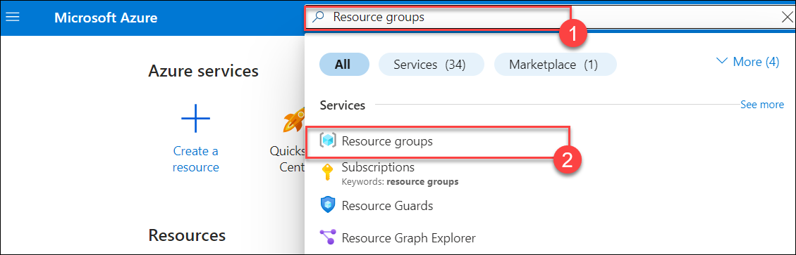

2. From the Resource groups page, click on **ODL-AzureAI-MS-<inject key="DeploymentID" enableCopy="false"/>**.

   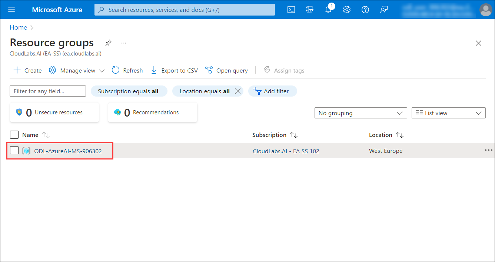

3. From the **Overview (1)** tab select the Azure Machine Learning workspace **asamlworkspace<inject key="DeploymentID" enableCopy="false"/> (2)**.

   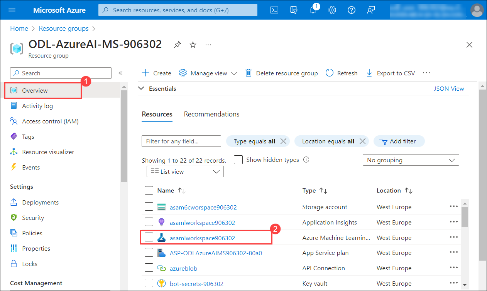
   
4. On Azure Machine Learning workspace click on **Launch studio**.

   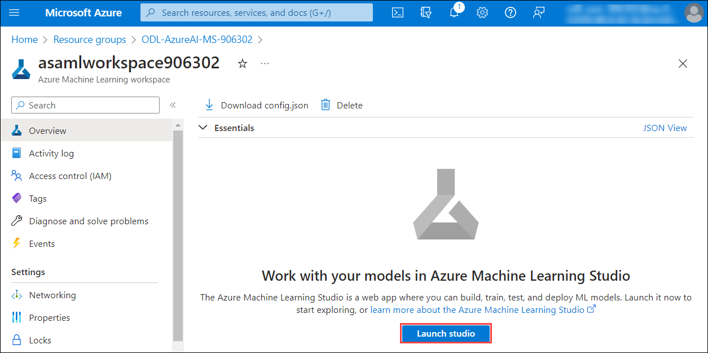

5. In Microsoft Azure Machine Learning Studio, click on **Notebooks (1)**. When you click on "Notebook," a pop-up will appear prompting you to create a notebook. Click "Cancel." Then, click on **Open Terminal (2)** and run the commands listed below.
    

   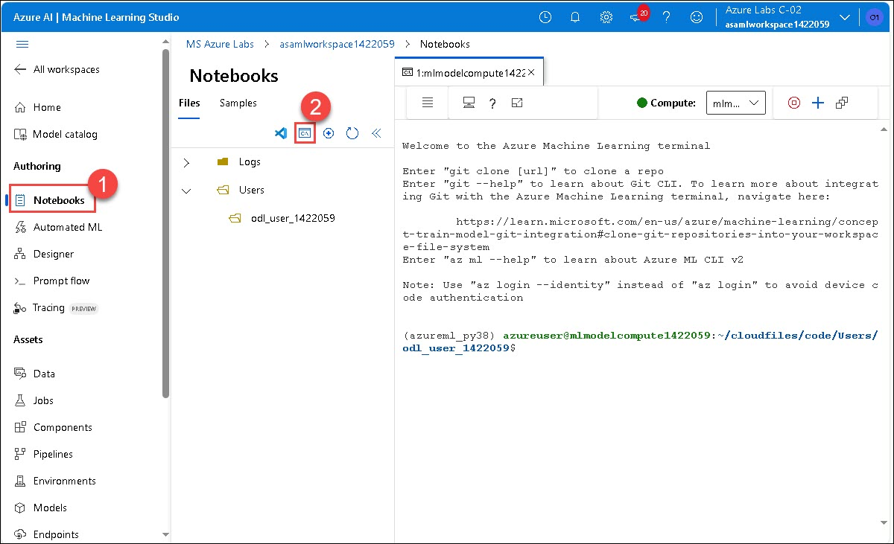

    ```
    cd artifacts/openai-model
    ```

    ```
    pip install enum34
    pip install cmdstanpy==0.9.5
    ```
   
    ```
    pip install --upgrade -r requirements.txt
    ```
    
    ```
    pip install numpy==1.22.0  
    ```
    
    ```
    pip install --upgrade pip
    ```
    
   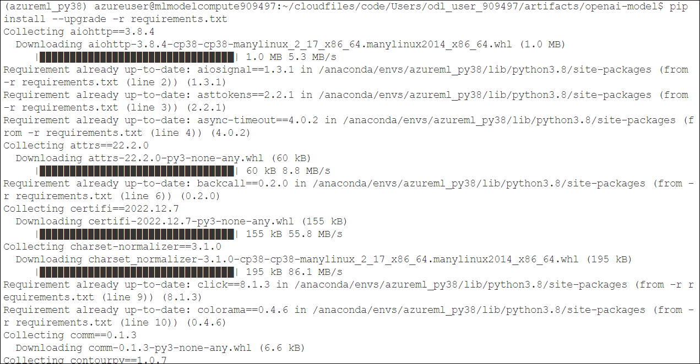


   > **Note** : If you encounter a "path not found" error, close the terminal, reopen it, and re-run the commands from the beginning.
   
   > **Note** : Please ignore any warnings during the execution. The final output should indicate that the process has succeeded and the installation is complete and if you encounter **ERROR: pip's dependency resolver does not currently take into account all the packages that are installed**, please ignore it and continue.

7. Now you need to restart the compute instance after installing the required packages. Follow the below steps to restart the compute instance:

   -  Select **Compute (1)** under Manage
   -  Choose the pre-deployed compute instance **mlmodelcompute<inject key="DeploymentID" enableCopy="false"/> (2)**
   -  Click on **Restart (3)**

      

    > **Note:** Wait for the restart to be completed.
   
## Task 2: Update the configuration file with newly generated credentials

In this task, you will update the configuration file with the newly generated API credentials, allowing your environment to securely connect to the OpenAI model.

1. Navigate back to the Azure Portal and from the **Overview (1)** page of the resource group select Azure Open AI **OpenAI<inject key="DeploymentID" enableCopy="false"/> (2)**.

    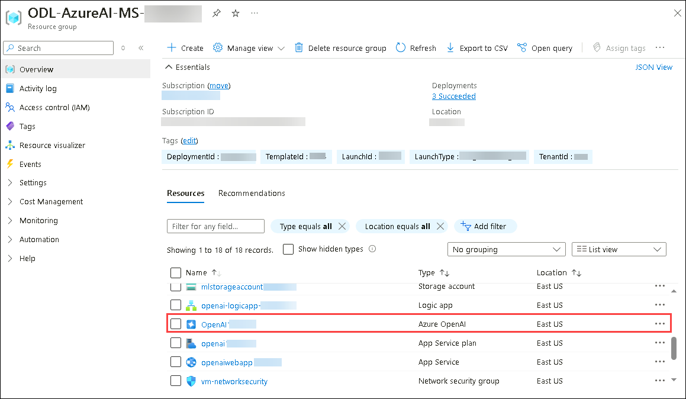
    
1. On the OpenAI **Overview (1)** page and right-click on **Go to Azure OpenAI Studio (2)** button .

   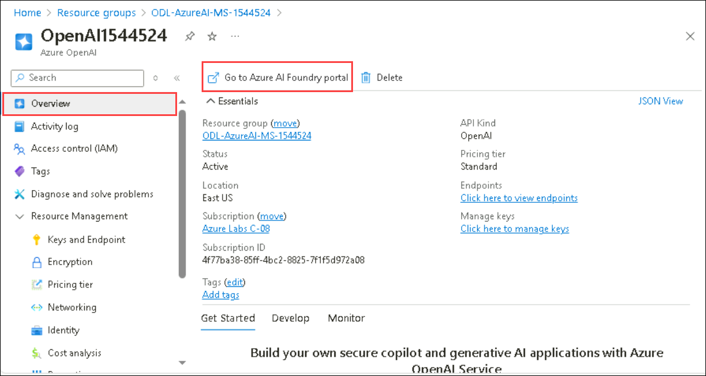

1. In the **Azure OpenAI Studio**, select **Deployments** under Shared resources ,click on **+ Deploy model** and select **Deploy base model**.

   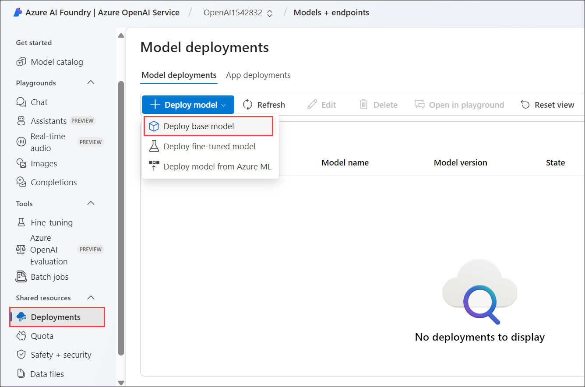

1. On the Select a model pop-up, Select **text-embedding-ada-002 (1)** and click on **Confirm(2)**.

   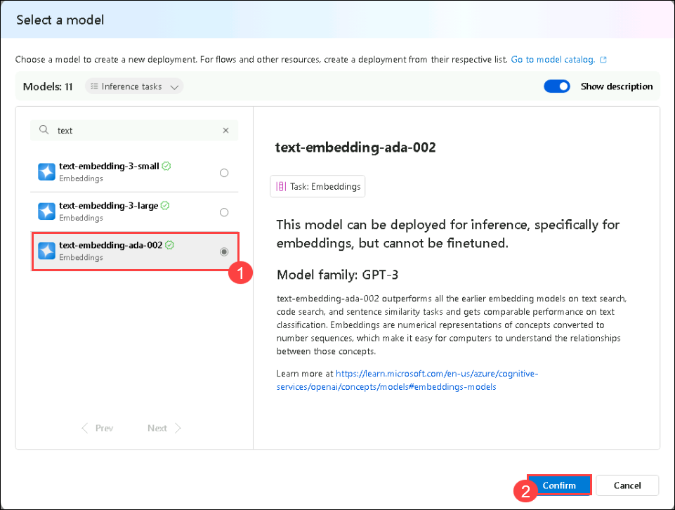
   
1.  On the Deploy model text-embedding-ada-002 pop-up enter the deployment name as **ada002(1)** and scale down the **Tokens per Minute Rate Limit (thousands) (2)** to **5k** then click on **Deploy (3)**.

    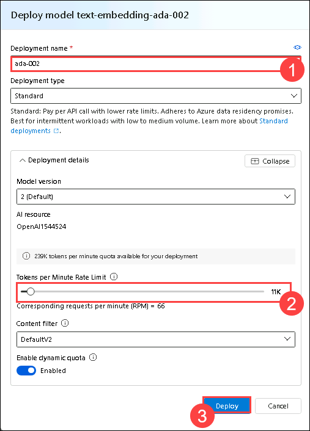

1. Now again Click on **+ Deploy model** from Deployments and select **Deploy base model**.

   

1. On the Select a model pop-up, Select **gpt-35-turbo-instruct (1)** and click on **Confirm(2)**.

    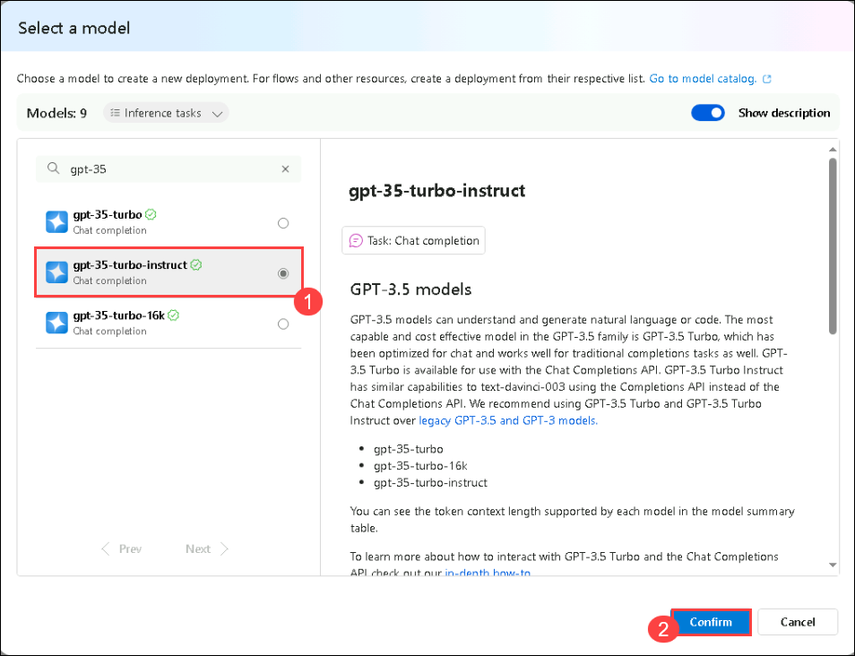
   
3. On the Deploy model gpt-35-turbo-instruct pop-up , enter the deployment name as **davinci003 (1)**,from Model Version drop-down select **0914** and scale down the **Tokens per Minute Rate Limit (thousands) (2)** to **10k** then click on **Deploy (3)**.

   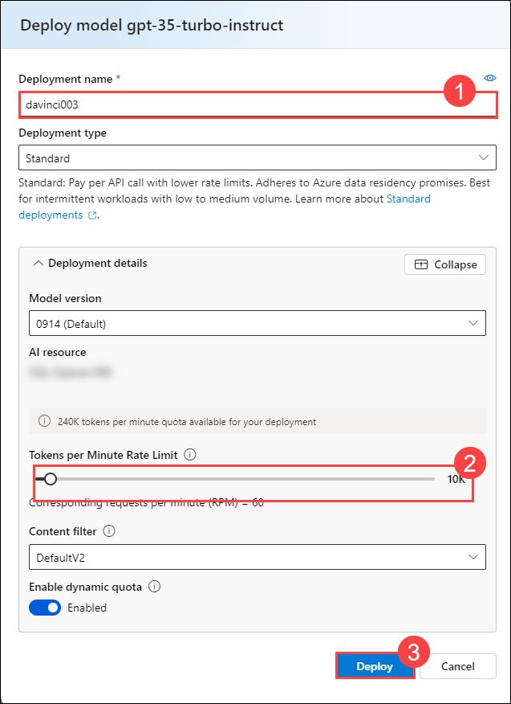

1. Now navigate back to the Azure portal, click on **Keys and Endpoints (1)**, select **Show Keys (2)**, and copy the values of **Key 1 (3)** and **Endpoint (4)** in a notepad. You will be using these values in the next steps.

   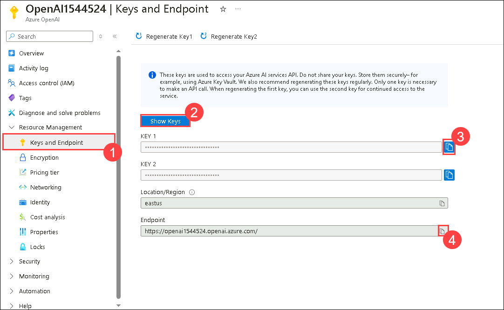
    
1. Navigate to Azure Machine Learning Studio, click on **Notebooks** and expand **Openai-model (1)** folder then click on **config.json (2)**.

   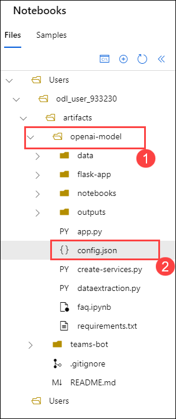
  
1. Follow the below instructions to replace the values:

   - **API_KEY**: Enter the value of **Key (1)** of Open AI you have copied in step-2
   - **API_BASE**: Enter the value of **Endpoint (2)** of Open AI you have copied in step-2
   - **COGNITIVE_API_KEY**: Enter the value **<inject key="SearchService Key" enableCopy="true"/> (3)**
   - **CONNECTION_STRING**: Enter the value **<inject key="StorageAccountConnectionString" enableCopy="true"/> (4)**
   - **COGNITIVE_SEARCH_NAME** Enter the Value **<inject key="SearchService Name" enableCopy="true"/> (5)**
   - **COGNITIVE_ENDPOINT** Enter the Value **<inject key="SearchService Endpoint" enableCopy="true"/> (6)**

      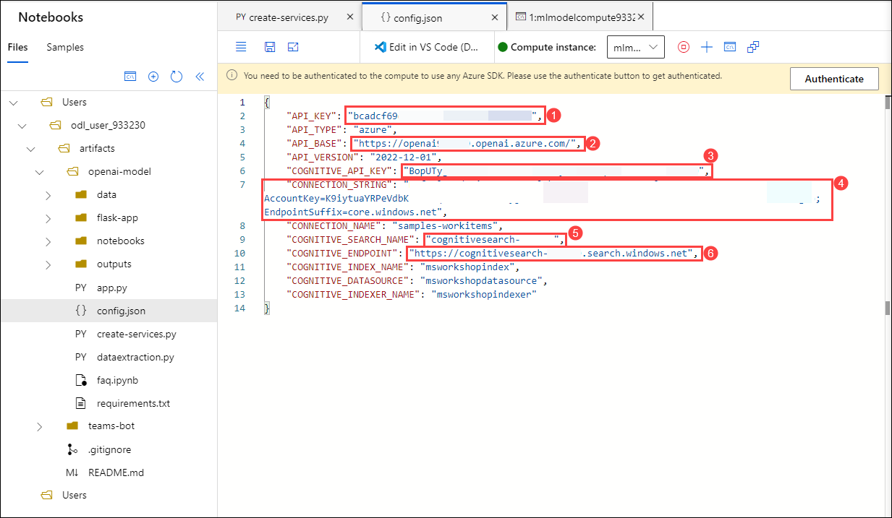

 >**Note**: Click on authenticate
   
1. Select on **Save (1)**.

   > **Congratulations** on completing the task! Now, it's time to validate it. Here are the steps:
   > - Hit the Validate button for the corresponding task. If you receive a success message, you can proceed to the next task.
   > - If not, carefully read the error message and retry the step, following the instructions in the lab guide.
   > - If you need any assistance, please contact us at cloudlabs-support@spektrasystems.com. We are available 24/7 to help you out.

   <validation step="ee4612c3-def6-401b-8e30-41ab9133aac5" />

## Task 3: Experiment with notebooks to explore data and model

In this task, you will experiment with the Python notebooks to explore the provided data, interact with the model, and create embeddings based on the extracted data.

1. Navigate to the **notebooks** folder, open **create-services.py** file from the path **Users/odl_user_<inject key="DeploymentID" enableCopy="false"/>/artifacts/openai-model**

   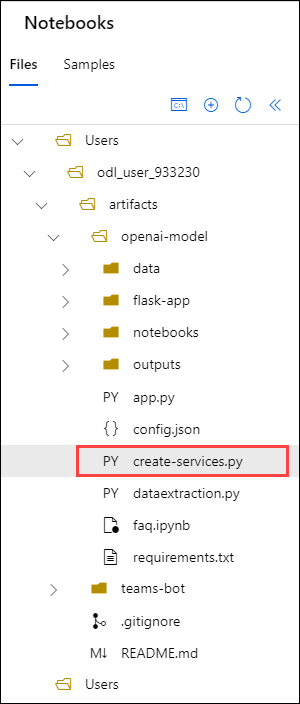

1. Select on **Save and run script in terminal**.

   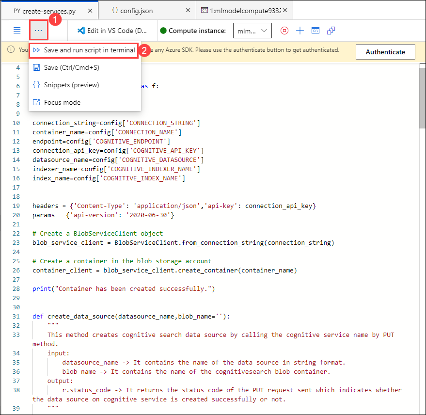
    
   > **Info:** This will open a  new terminal window and will run the file. 
     
1. Navigate to the **notebooks** folder, open **dataextraction.py** file from the path **Users/odl_user_<inject key="DeploymentID" enableCopy="false"/>/artifacts/openai-model**

    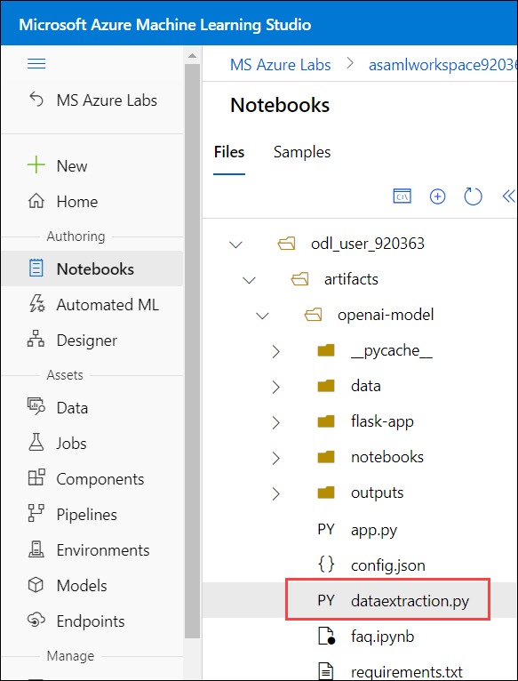

1. Select on the eclipse **(...)** **(1)** and click on **Save and run script in terminal (2)**.

   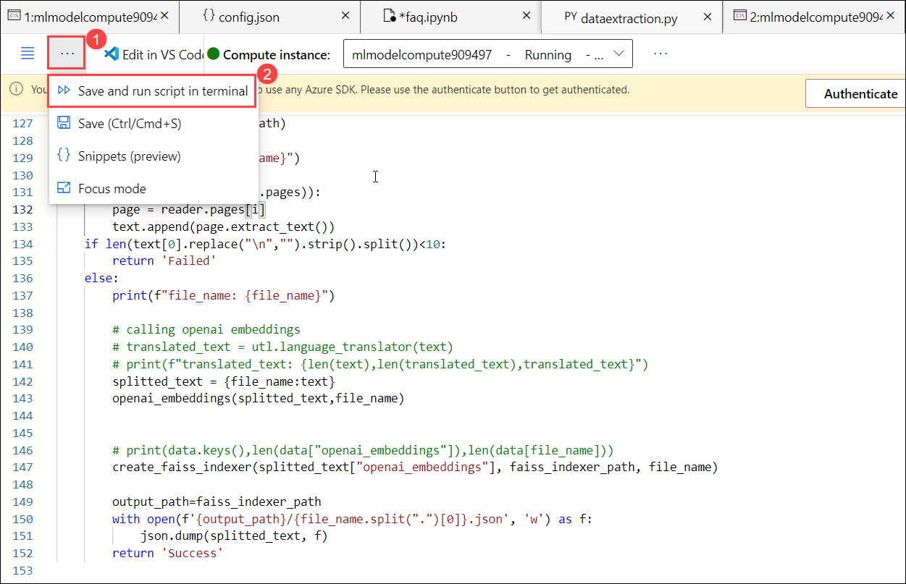
    
   > **Info:** This will open a  new terminal window and will run the file. 
  
1. Navigate back to the **openai-model** folder, select **faq.ipynb (1)** file and select the kernal as **Python 3.8-AzureML (2)**.

   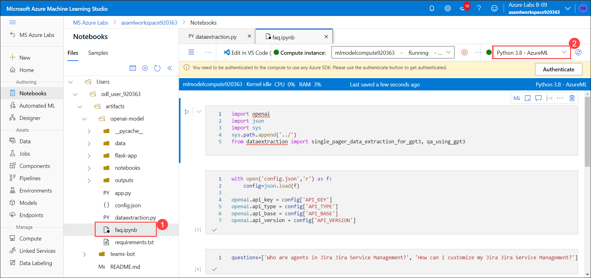
   
1. Run each cell one after the other and observe the output.

   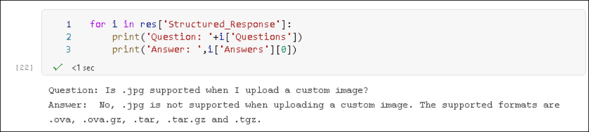
   
 >**Note**: If you encounter any errors, please re-run the cell or you can restart the kernel, clear all outputs, and try running all the cell again from beginning.

   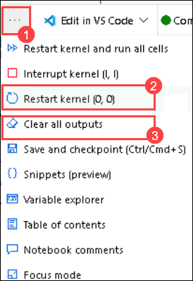

## Summary

In this exercise, you have installed the required packages from the Machine learning studio and deployed the Model in Open AI by running the Python notebook from the Machine learning studio.

### You have successfully completed the lab
