## Lab 1. Leveraging an OpenAI model to create extract data and create embeddings


### Task 1. Install all the required libraries using requirements.txt file


1. In Azure Portal, click on **Resource groups** from the Navigate panel.

   

1. From the Resource groups page, click on **ODL-AzureAI-MS-<inject key="PostGre SQL Password" enableCopy="false"/>**.

   

1. From the **Overview (1)** tab select the Azure Machine Learning workspace **asamlworkspace<inject key="DeploymentID" enableCopy="false"/> (2)**.

   
   
1. On Azure Machine Learning workspace click on **Launch studio**.

   
   
1. On **Machine Learning Studio** page, click on **Notebooks (1)**, then click on **Add files (2)** and select **Upload folder (3)**.

    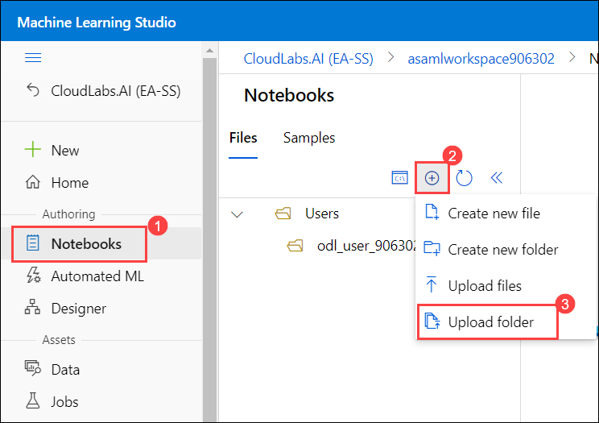
    
    > **Note :** If you see any pop-up naming **What's new in Notebooks** click on **Close**.

      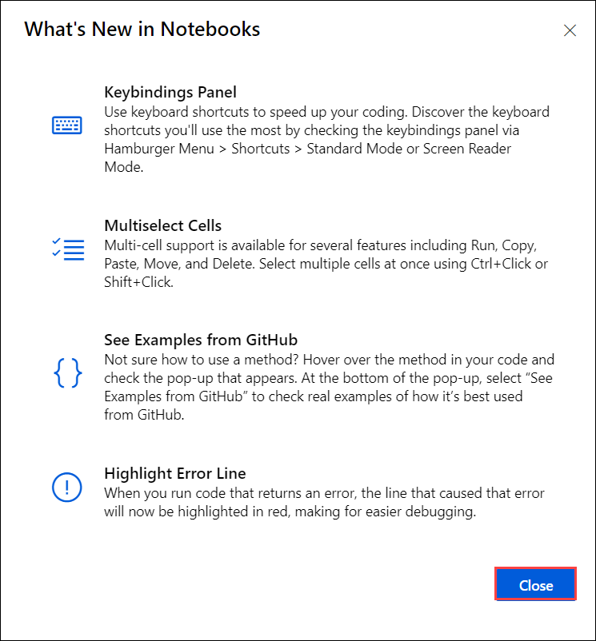
      
1. Click on **+** to upload the folder into the workspace.

   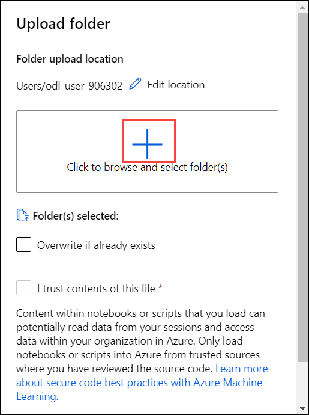
    
1. Navigate to the path **C:\LabFiles (1)** and select **artifacts (2)** folder.

   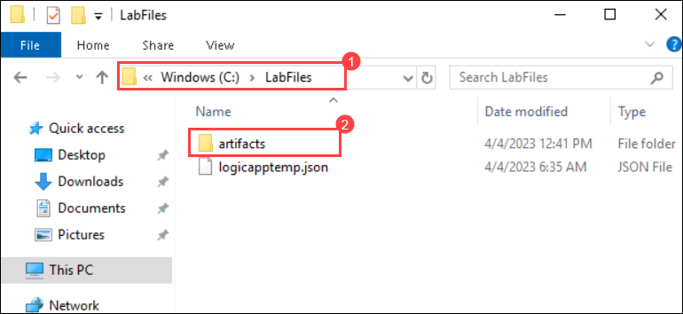
 
1. On the pop up tab click on **Upload** to upload the files to workspace.

    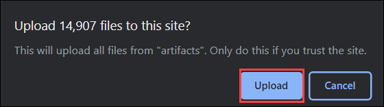
    
3. Check the box next to **I trust contents of this file (1)** and click on **Upload (2)**.

    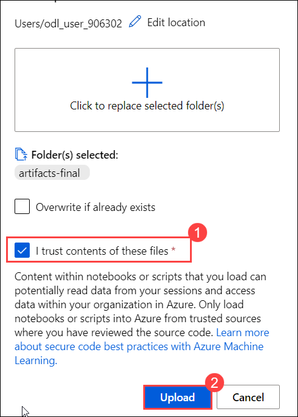
    
   > **Note :** Wait for 10-15 minutes until the files get uploaded.

1. On Microsoft Azure Machine Learning Studio click on **Open Terminal** and run the below mentioned commands

    ```
    cd artifacts/openai-model
    ```
    
    ```
    pip install --upgrade -r requirements.txt
    ```
    
    
    
    
    
### Task 2 : Update the configuration file with newly generated credentials

1. Navigate back to the Azure Portal and from the **Overview (1)** page of resource group select Azure Open AI **OpenAI<inject key="DeploymentID" enableCopy="false"/> (2)**.

    
    
1. Click on **Keys and Endpoints (1)** and copy the values of **Key 1 (2)** and **Endpoint (3)** in a Notepad. You will be using these values in the next steps.

   
   
1. Navigate to Azure Machine Learning Studio and expand **utils (1)** folder then click on **config.json (2)**.

   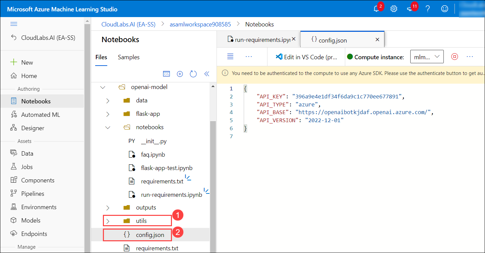
   
1. Replace the values of **API_KEY** and **API_BASE** with **Key (1)** and **Endpoint (2)** of Open AI respectively.

   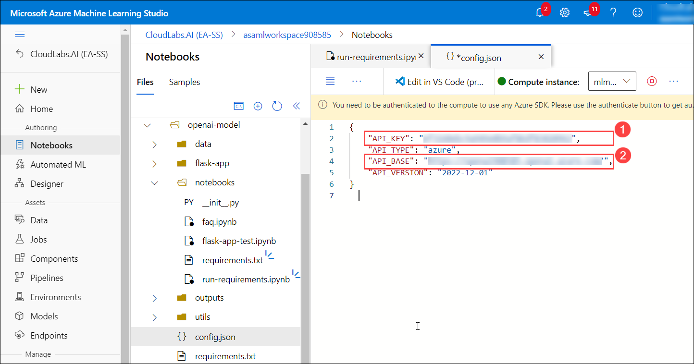
   
1. Select on **eclipse (1)** and click on **Save (2)**.

   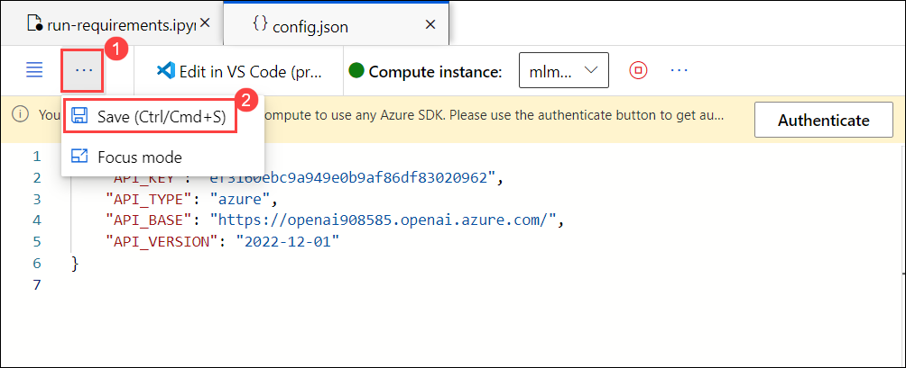
   
### Task 3 : Experiment with notebooks to explore data and model

1. Navigate to the **notebooks** folder, select **faq.ipynb (1)** file and select the kernal as **Python 3.8-Jupyter (2)**.

   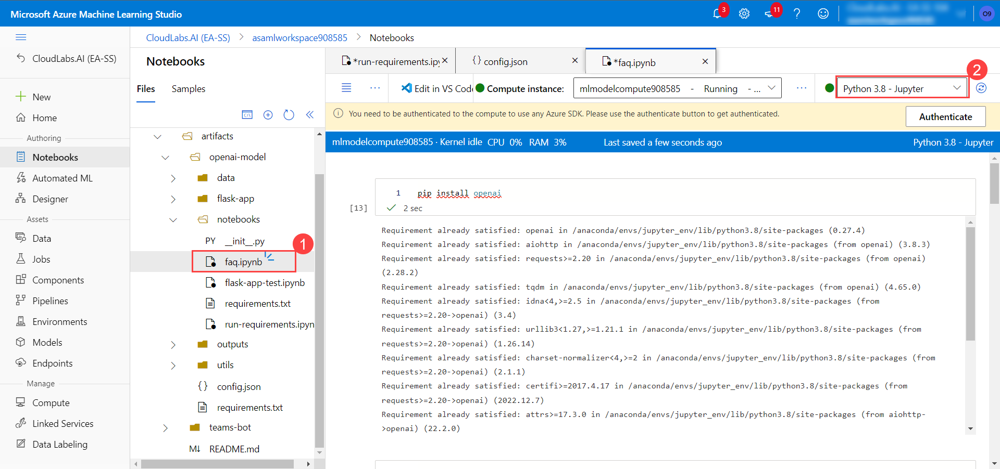
   
1. Run each cell one after the other and observe the output.

### Task 4 : Review all the modules

1. Navigate back to the Azure Portal and from the **Overview (1)** page of resource group select Azure Open AI **OpenAI<inject key="DeploymentID" enableCopy="false"/> (2)**.

    
    
1. Click on **Model deployments (1)** and review the deployment models **(2)**.

    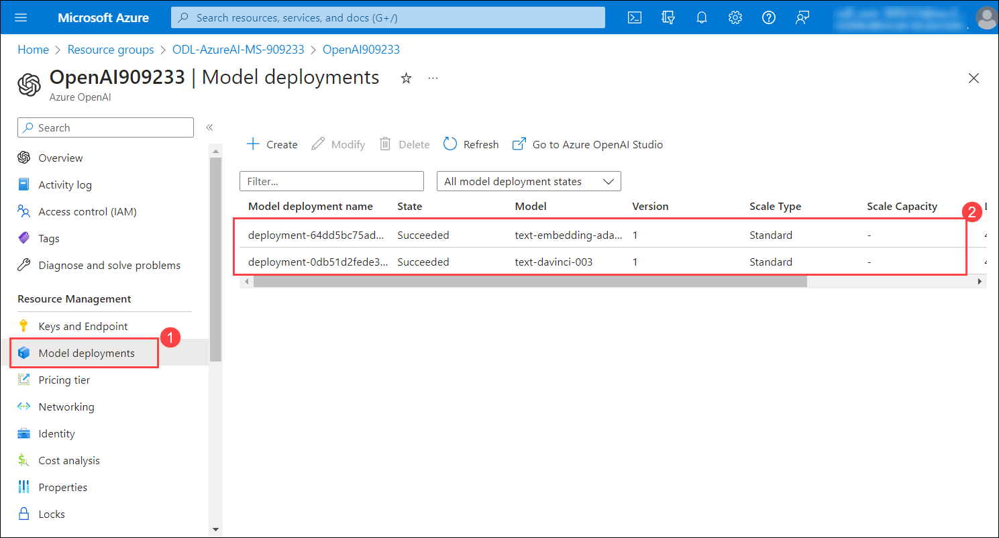
    
  
