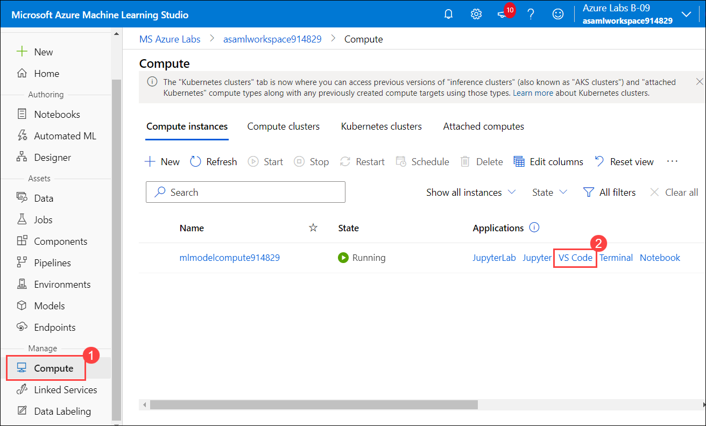
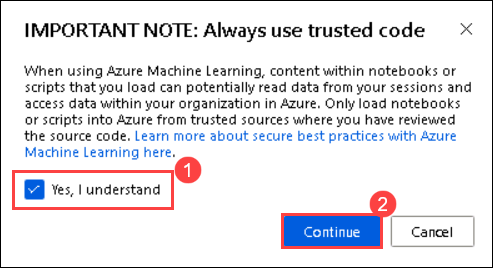
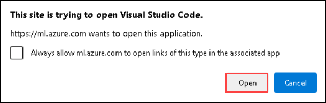
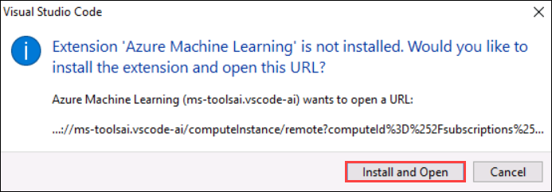
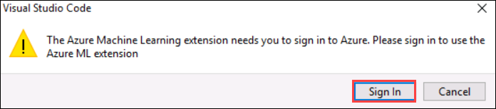
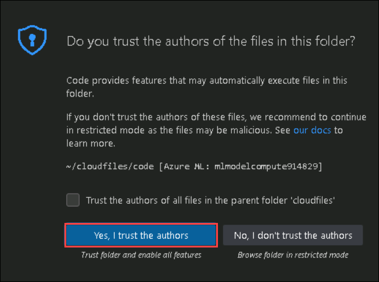
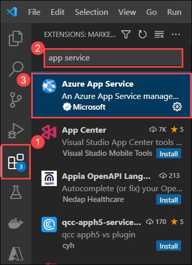
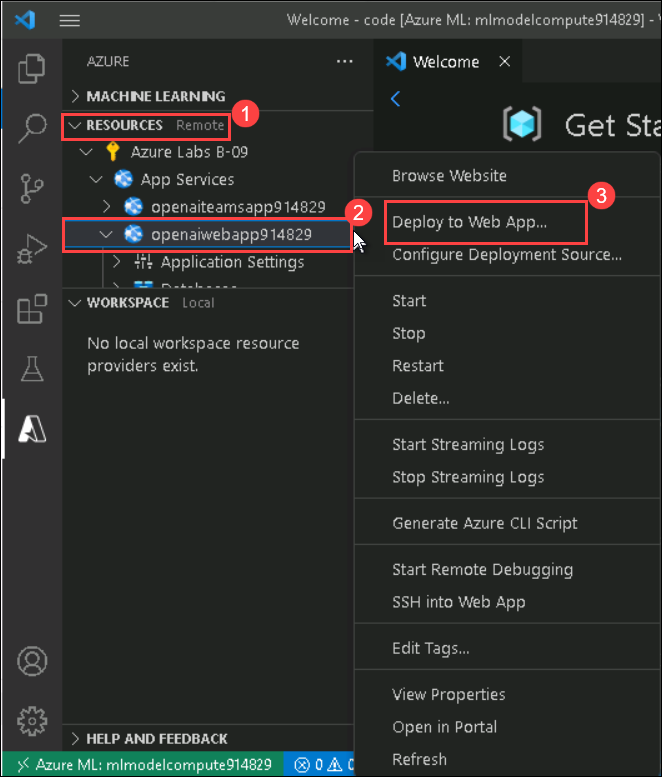
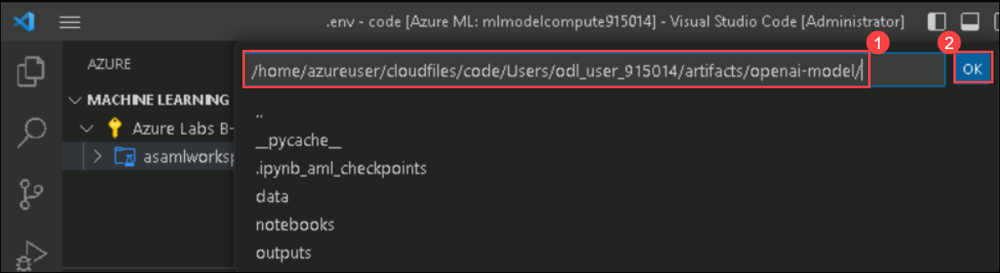

## Exercise 2. Deploying the model using Flask framework locally and on Azure App Service. Setting up Email Automation Workflow on Azure Logic.

In this exercise, you will deploy the model using Flask framework locally and also from Azure app service. You will also trigger the Azure Logic App workflow by sending the High level priorty mail to the ODL user.

### Task 1 : Deploy the model by running the Flask wrapper locally

    
1. Navigate to **Microsoft Azure Machine Learning Studio** and click on **Open Terminal**.

   
   
1. Navigate to the required path by running the below given command on the Terminal page:

    ```
    cd artifacts/openai-model
    ```
1. Run the below mentioned command to run the Flask wrapper and copy the generated local host URl:

   ```
   flask run
   ```
   
   
### Task 2: Test the locally-deployed API with specified request/response formats

1. Navigate to the **notebooks** folder, select **flask-app-local-test.ipynb (1)** file and select the kernal as **Python 3.8-AzureML (2)**.

    
    
1. Run each cell one after the other and observe the output. 

   
    
### Task 3: Deploy the model on Azure App Service

1. From **Microsoft Azure Machine Learning Studio**, click on **Compute (1)** and select **VS Code (2)** next to **mlmodelcompute<inject key="DeploymentID" enableCopy="false"/>** Compute Instance.

    

1. On **IMPORTANT NOTE : Always use trusted code** pop up check the box next to **Yes, I understand (1)** and click on **Continue (2)**.

    

1. Click on **Open** on the pop-up.

    
    
3. On Visual Studio Code pop up click on **Install and Open**.

    
    
1. Click on **Sign In**, to login into Azure Portal  in Visual Studio Code.

    
    
1. On the **Sign into Microsoft Azure** tab, you will see the login screen, enter the following username, and, then click on **Next**.

   * Email/Username: <inject key="AzureAdUserEmail"></inject>

   

3. Now enter the following password and click on **Sign in**. 

   * Password: <inject key="AzureAdUserPassword"></inject>

   
   

1. On **Do you trust the authors of the file of this folder** tab, click on **Yes, I trust the authors**.

    

1. Click on **Extensions (1)** and search for **App service (2)** then select it **(3)**.

    
    
1. Click on **Install** to install the App service extension.

    
    
3. Now, expand **Resources (1)** from Azure extension and right-click on **openaiwebapp<inject key="DeploymentID" enableCopy="false"/> (2)** then click on **Deploy to web app (3)**.

    
    
1. Navigate to the path **/home/azureuser/cloudfiles/code/Users/odl_user_<inject key="DeploymentID" enableCopy="false"/>/artifacts/openai-model (1)** and click on **Ok (2)**.

    

   
1. Make sure that the deployment is completed on web app.
   
   
   
   > **Note :** Wait for 10-15 minutes until the deployment is completed.
   
### Task 4: Test the cloud-deployed API with specified request/response formats

1. Navigate to the **notebooks** folder, select **flask-app-test-appservice.ipynb (1)** file and select the kernal as **Python 3.8-AzureML (2)**.

   
    
1. Run each cell one after the other and observe the output. Make sure you update the **SUFFIX** with the value **<inject key="DeploymentID" enableCopy="false"/>**.

   

