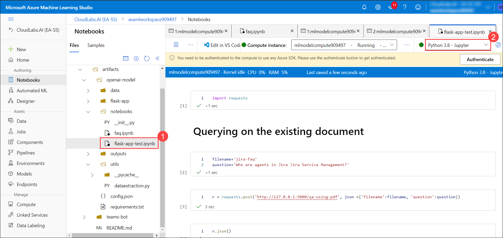
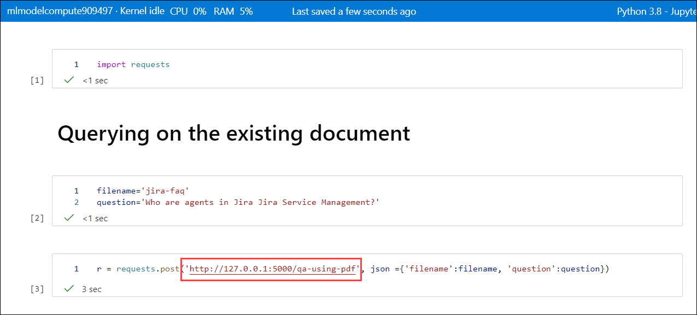

## Lab 2. Deploying the model using Flask framework locally and on Azure App Service. Setting up Email Automation Workflow on Azure Logic.


### Task 1 : Deploy the model by running the Flask wrapper locally

1. Navigate to **Microsoft Azure Machine Learning Studio** and click on **Open Terminal**.

   
   
1. Navigate to the required path by running the below given command on the Terminal page:

    ```
    cd artifacts/openai-model/flask-app
    ```
1. Run the below mentioned command to run the Flask wrapper and copy the generated local host URl:

   ```
   flask run
   ```
   
   
### Task 2: Test the locally-deployed API with specified request/response formats

1. Navigate to the **notebooks** folder, select **flask-app-test.ipynb (1)** file and select the kernal as **Python 3.8-Jupyter (2)**.

    
    
1. Run each cell one after the other and observe the output. Make sure you update the URL **https://techimmersionsfopen.azurewebsites.net** with the local host URL that you have copied in Task-1/Step-3.

    
    
### Task 3: Deploy the model on Azure App Service

### Task 4: Test the cloud-deployed API with specified request/response formats


### Task 5 : Setup email automation workflow on Azure Logic Apps using
