## Exercise 2. Deploying the model using Flask framework locally and on Azure App Service. Setting up Email Automation Workflow on Azure Logic.

In this exercise, you will deploy the model using Flask framework locally and also from Azure app service. You will also trigger the Azure Logic App workflow by sending the High level priorty mail to the ODL user.

### Task 1 : Deploy the model by running the Flask wrapper locally

1. Navigate to **Microsoft Azure Machine Learning Studio** and click on **Open Terminal**.

   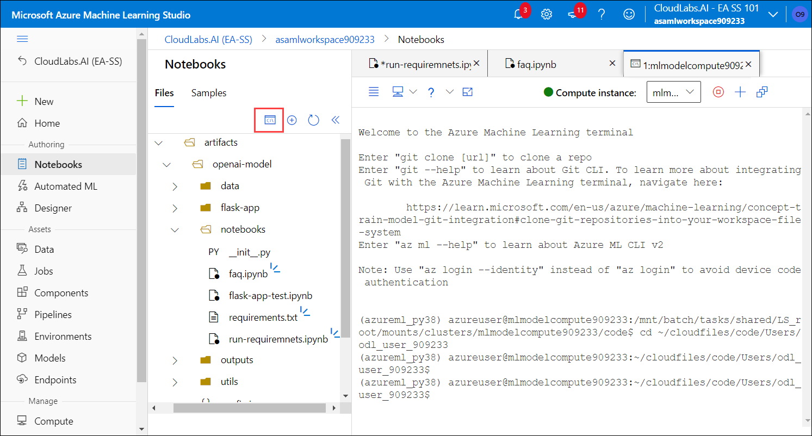
   
1. Navigate to the required path by running the below given command on the Terminal page:

    ```
    cd artifacts/openai-model
    ```
1. Run the below mentioned command to run the Flask wrapper and copy the generated local host URl:

   ```
   flask run
   ```
   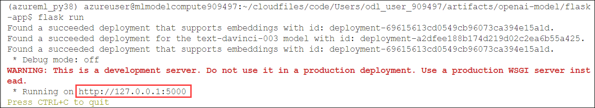
   
### Task 2: Test the locally-deployed API with specified request/response formats

1. Navigate to the **notebooks** folder, select **flask-app-local-test.ipynb (1)** file and select the kernal as **Python 3.8-AzureML (2)**.

   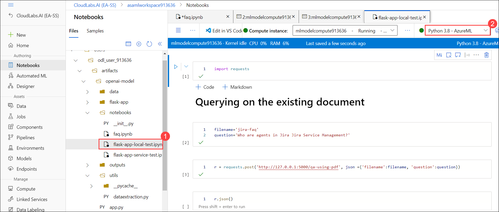
    
1. Run each cell one after the other and observe the output. 

   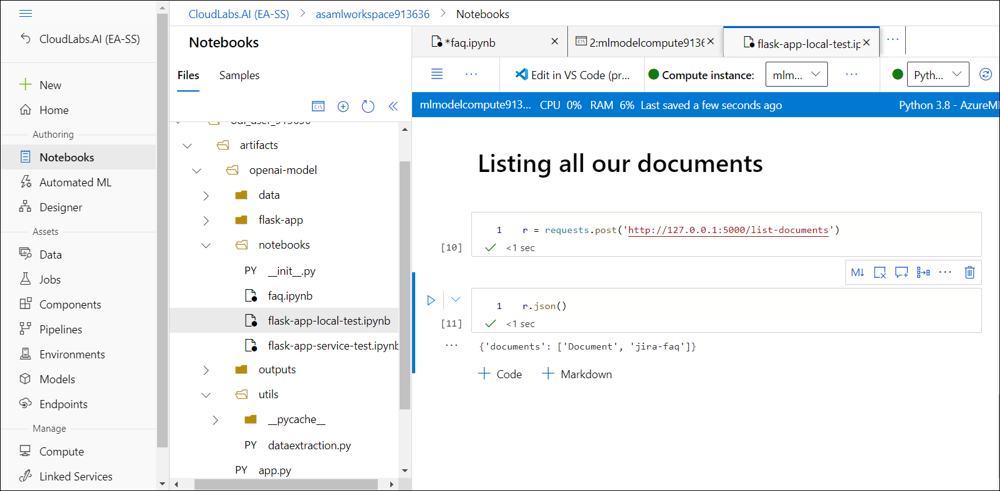
    
### Task 3: Deploy the model on Azure App Service

1. In Azure Machine Learning Studio, open a new terminal and run the below given commands:

   ```
   cd artifacts/openai-model
   ```
   
   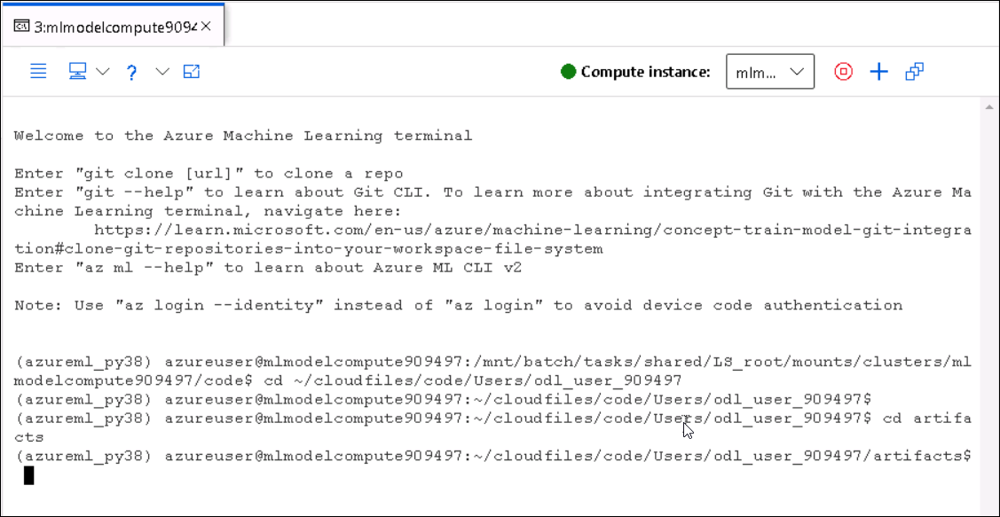
   
   - RUn the below commands to folder as Zip file
   
   ```
   zip -r openai-model.zip .
   ```
   
   - Run the below command to login into the azure portal.
   ```
   az login --identity
   ```
   
   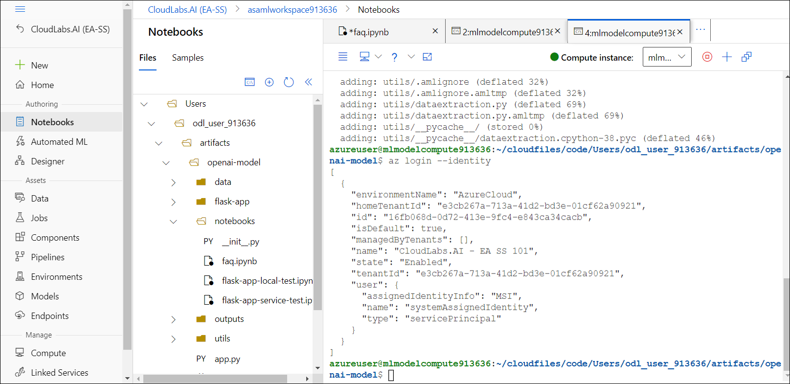

   
   - Before running the below command update `<DID>` with **<inject key="DeploymentID" enableCopy="false"/>**.
   
   ```
   az webapp deploy --resource-group ODL-AzureAI-MS-<DID> --name openaiwebapp<DID> --src-path openai-model.zip --type=startup
   ```
   
   - After running the commands successfully, you can observe the **openai-model.zip** file under **artifacts** folder.
   
   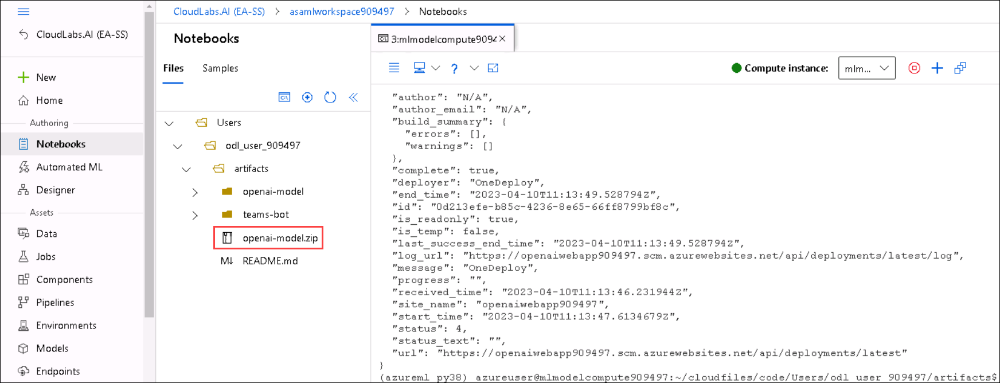
   
   - Copy the web app URL and note it down in a Notepad. You will be using it in coming task.
   
   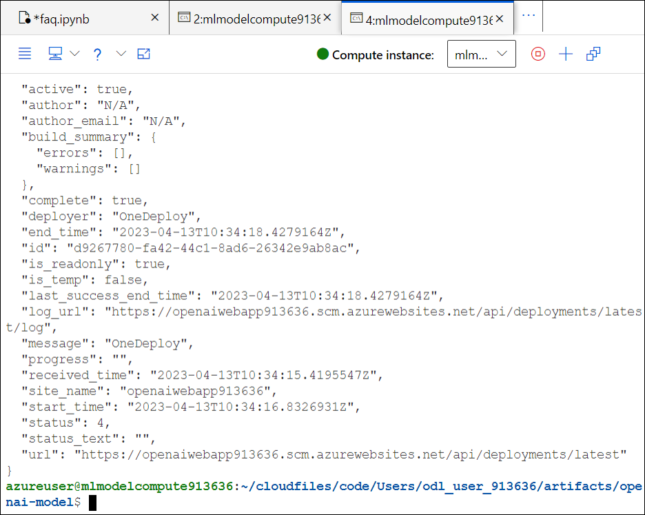
   
### Task 4: Test the cloud-deployed API with specified request/response formats

1. Navigate to the **notebooks** folder, select **flask-app-test-appservice.ipynb (1)** file and select the kernal as **Python 3.8-Jupyter (2)**.

   
    
1. Run each cell one after the other and observe the output. Make sure you update the **SUFFIX** with the value **<inject key="DeploymentID" enableCopy="false"/>**.

   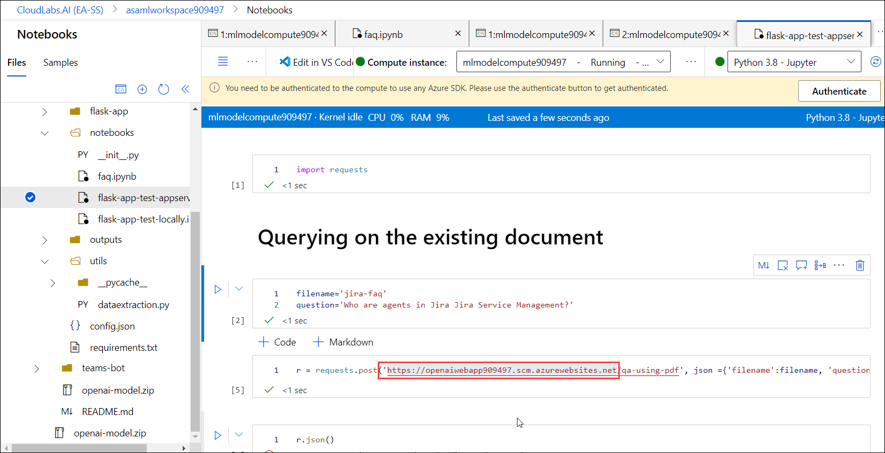

### Task 5 : Setup email automation workflow on Azure Logic Apps using

1. Navigate back to the Azure Portal and from the **Overview (1)** page of resource group select **Office 365 (2)** API connection.

   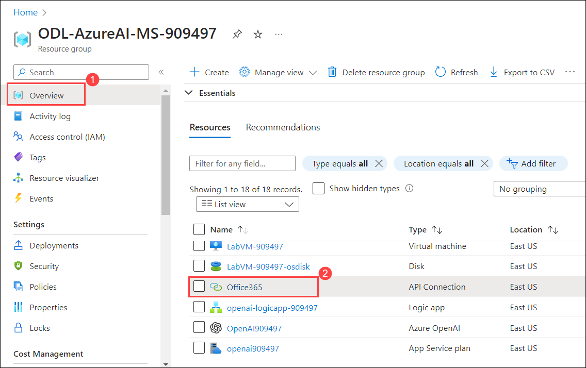
   
1. Click on **Edit API Connection (1)** and click on **Authorize (2)**.

   
   
1. Select your Azure account to sign in.

   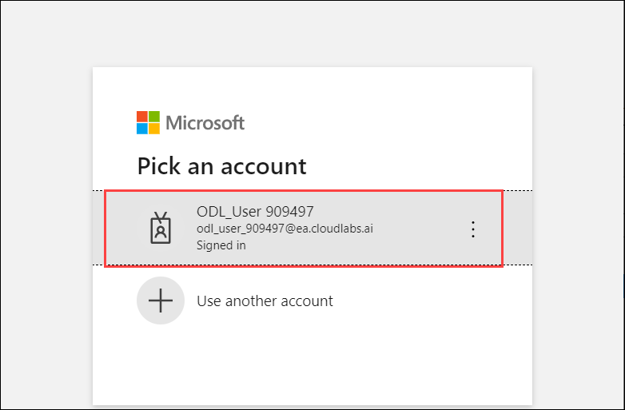
   
1. Click on **Save**.

    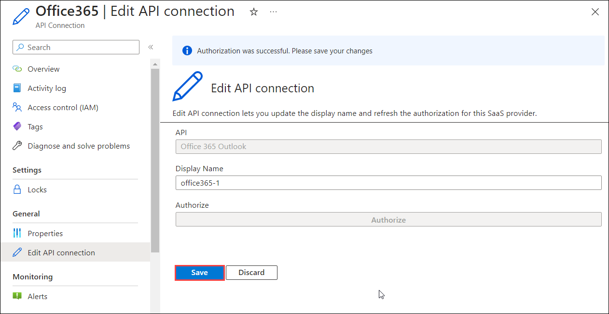

1. Navigate back to resource group and from the **Overview (1)** page of resource group select **azureblob (2)** API connection.

    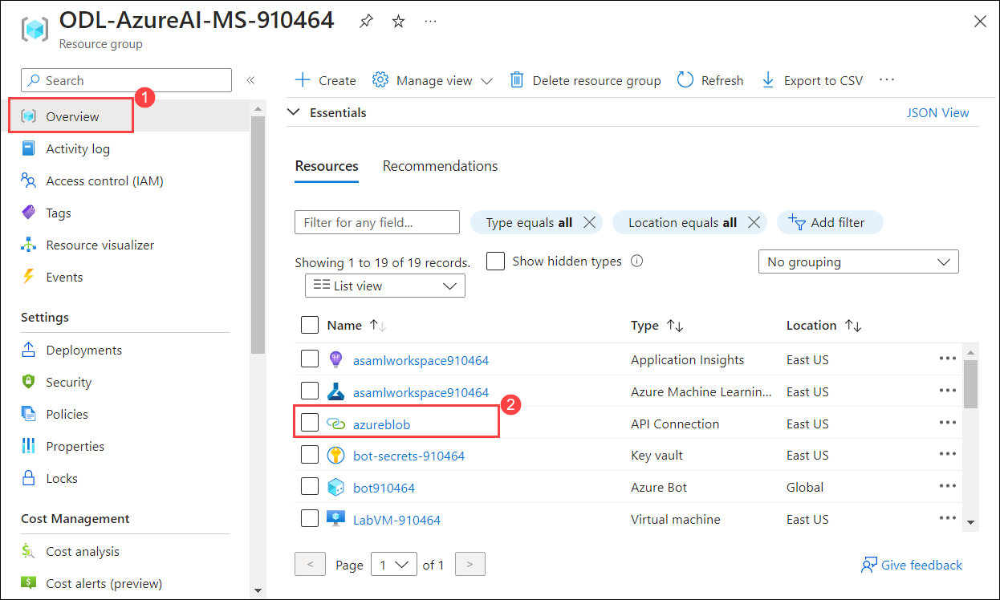
    
1. On azureblob API connection page, follow the below mentioned instruction : 

    - Click on **Edit API connection (1)**
    - **Azure Storage account name or blob endpoint** :  Enter **mlstorageaccount<inject key="DeploymentID" enableCopy="false"/> (2)**
    - **Azure Storage Account Access Key** : Enter **<inject key="StorageaccountKey" enableCopy="true"/> (3)**
    - Click on **Save (4)**

    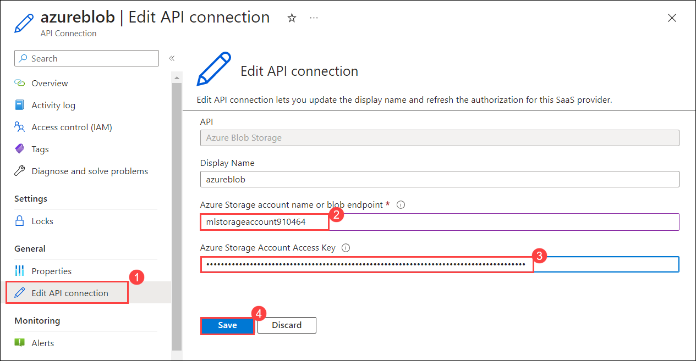

1. From Azure Portal, navigate to Logic app **openai-logicapp-<inject key="DeploymentID" enableCopy="false"/>** and click on **Enable**.

    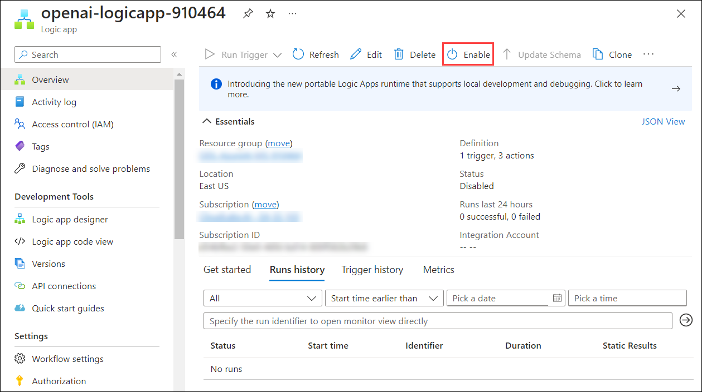
    
3. Navigate to the URL `https://outlook.live.com/owa/` and click on  **Signin**.

    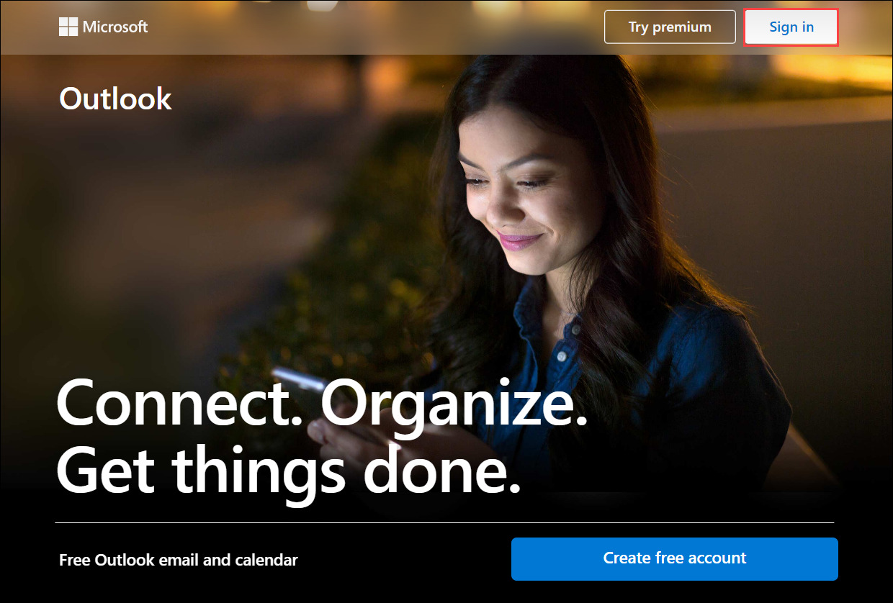
    
1. On the **Sign into Microsoft Azure** tab, you will see the login screen, enter the following username, and, then click on **Next**.

   * Email/Username: <inject key="AzureAdUserEmail"></inject>

   

3. Now enter the following password and click on **Sign in**. 

   * Password: <inject key="AzureAdUserPassword"></inject>

   

1. Now, send an **High level importance** email to the below user account by attaching **Document** pdf file in the mail from the path **C:\LabFiles\artifacts\openai-model\data**.

    * Email/Username: <inject key="AzureAdUserEmail"></inject>
    
    
    
1. Next, open the mail that is being triggered by the flow and review it.

    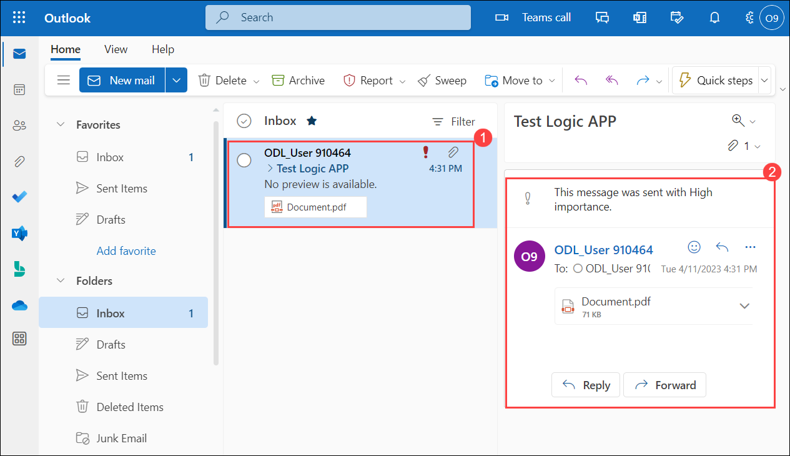
    
1. Now, return to Azure portal where the logic app page is opened and click on **Runs histroy (1)** then review that the run status as in **Succeeded (2)**.

    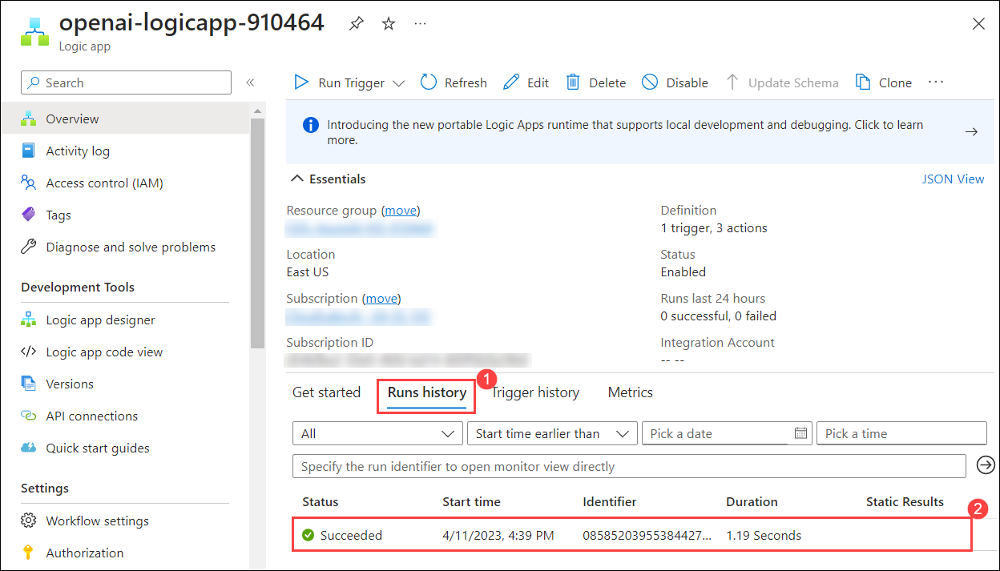
