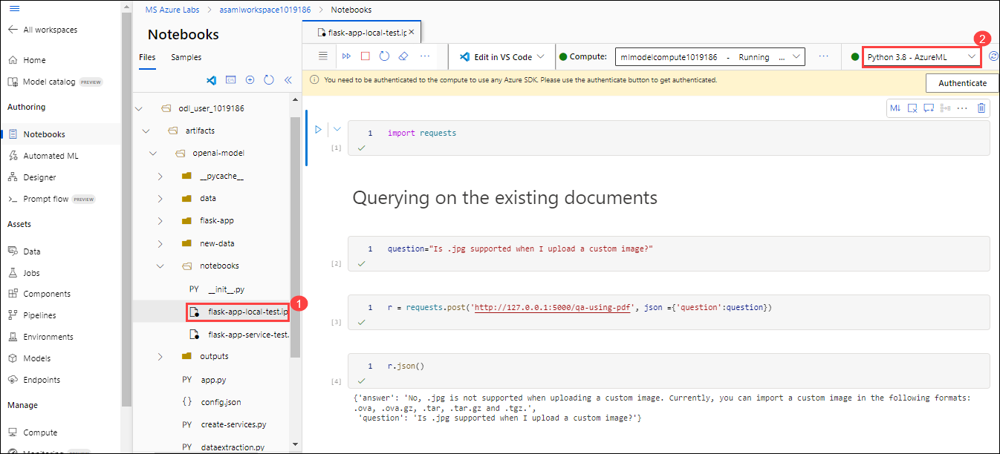
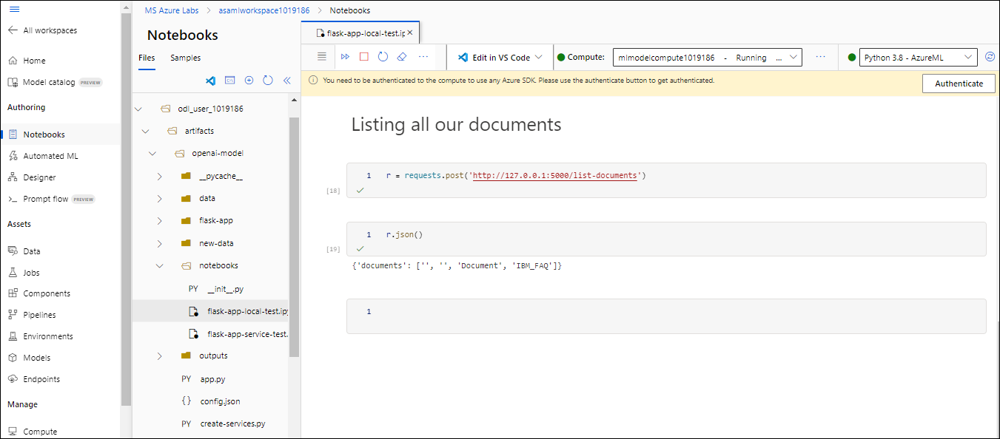
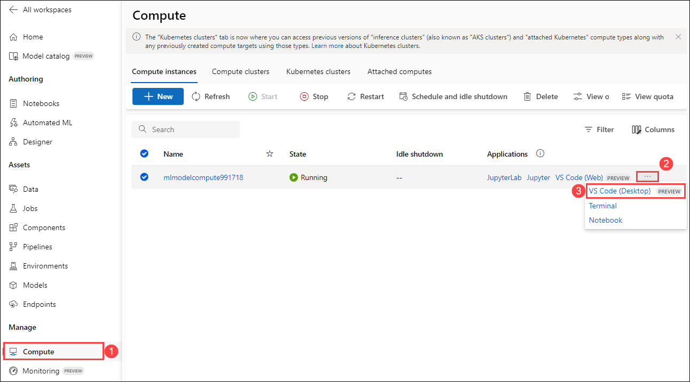
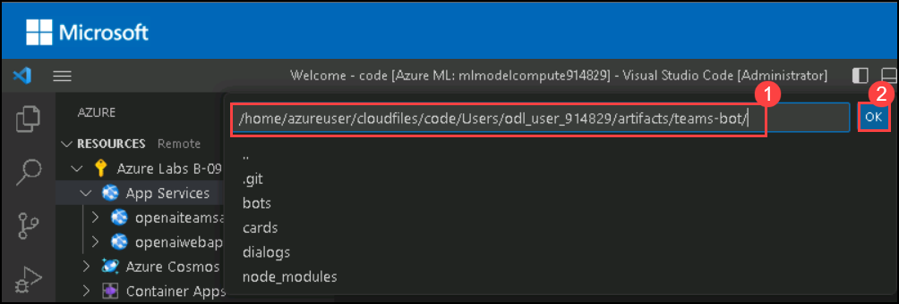
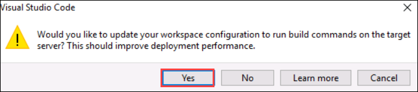
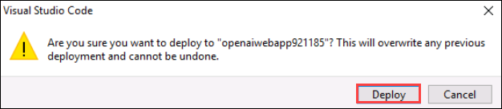
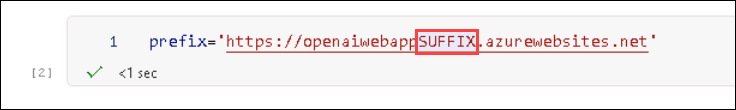

# Exercise 2: Deploying the model using Flask framework locally and on Azure App Service

### Estimated Duration: 60 minutes

In this exercise, you will deploy the model using the Flask framework locally and also from the Azure app service.

## Lab Objectives

You will be able to complete the following tasks:

- Task 1: Deploy the model by running the Flask wrapper locally
- Task 2: Test the locally-deployed API with specified request/response formats
- Task 3: Deploy the model on Azure App Service
- Task 4: Test the cloud-deployed API with specified request/response formats

## Task 1: Deploy the model by running the Flask wrapper locally
    
1. Navigate to **Microsoft Azure Machine Learning Studio** and click on **Open Terminal**.

   
   
1. Navigate to the required path by running the below-given command on the Terminal page:

    ```
    cd artifacts/openai-model
    ```
1. Run the below-mentioned command to run the Flask wrapper and copy the generated local host URL:

   ```
   flask run
   ```
   

   > **Note**: Don't hit **Ctrl + c**.
   
## Task 2: Test the locally-deployed API with specified request/response formats

1. Navigate to the **notebooks** folder, select **flask-app-local-test.ipynb (1)** file and select the kernal as **Python 3.8-AzureML (2)**.

    
    
1. Run each cell one after the other and observe the output. 

   
    
## Task 3: Deploy the model on Azure App Service

1. From **Microsoft Azure Machine Learning Studio**, click on **Compute (1)**, click on **... (2)** button and select **VS Code (Desktop) PREVIEW (2)** next to **mlmodelcompute<inject key="DeploymentID" enableCopy="false"/>** Compute Instance.

    

     > **Note:** If the **VS Code** doesn't open. Open the VS Code from the desktop, and re-perform **Step 1**.

1. On **IMPORTANT NOTE : Always use trusted code** pop up check the box next to **Yes, I understand (1)** and click on **Continue (2)**.

    

1. Click on **Open** on the pop-up.

    

   > **Note:** If the VScode doesn't open, try launching the VScode from the desktop, go back to the browser and hit refresh.  

3. On Visual Studio Code pop up click on **Install and Open**.

    
    
1. Click on **Sign In**, to login into Azure Portal from Visual Studio Code.

    
    
1. On the **Sign into Microsoft Azure** tab, you will see the login screen, enter the following username, and, then click on **Next**.

   * Email/Username: <inject key="AzureAdUserEmail"></inject>

   

3. Now enter the following password and click on **Sign in**. 

   * Password: <inject key="AzureAdUserPassword"></inject>

   
   

1. On the **Do you trust the authors of the file of this folder** tab, click on **Yes, I trust the authors**.

    

1. Click on **Extensions (1)** and search for **App service (2)** then select it **(3)**.

    
    
1. Click on **Install** to install the App service extension.

    
    
3. Select **Azure (1)** from the left-menu, expand **Resources (2)** from Azure extension and right-click on **openaiwebapp<inject key="DeploymentID" enableCopy="false"/> (3)** then click on **Deploy to Web App (4)**.

    
    
4. Click on **Browse**.

    

5. Navigate to the path **/home/azureuser/cloudfiles/code/Users/odl_user_<inject key="DeploymentID" enableCopy="false"/>/artifacts/openai-model (1)** and click on **Ok (2)**.

    
    
6. On Visual Studio Code pop up click on **Yes**

    
    
7. On the pop up **Are you sure you want to deploy to "openaiwebapp<inject key="DeploymentID" enableCopy="false"/>"?** click on **Deploy**.

    
   
8. Make sure that the deployment is completed on the web app. Also, click on **Don't show again** on the pop-up of setting up the **Always deploy the workspace** as it can cause issues in further exercises. 
   
   
   
   > **Note:** Wait for 10-15 minutes until the deployment is completed.
   
   > **Note:** If you encounter a deployment failure with error: (intermediate value).parsedBody.map is not a function you can ignore it and continue with the next task. 
   
## Task 4: Test the cloud-deployed API with specified request/response formats

1. Navigate to the **notebooks** folder, select **flask-app-service-test.ipynb (1)** file and select the kernal as **Python 3.8-AzureML (2)**.

   
    
1. Update the **SUFFIX** with the value **<inject key="DeploymentID" enableCopy="false"/>** value in the prefix variable section and run each cell one after the other and observe the output. 

   

## Summary

In this exercise, you have deployed the model using the Flask framework locally and from the Azure app service. 

### You have successfully completed the lab
