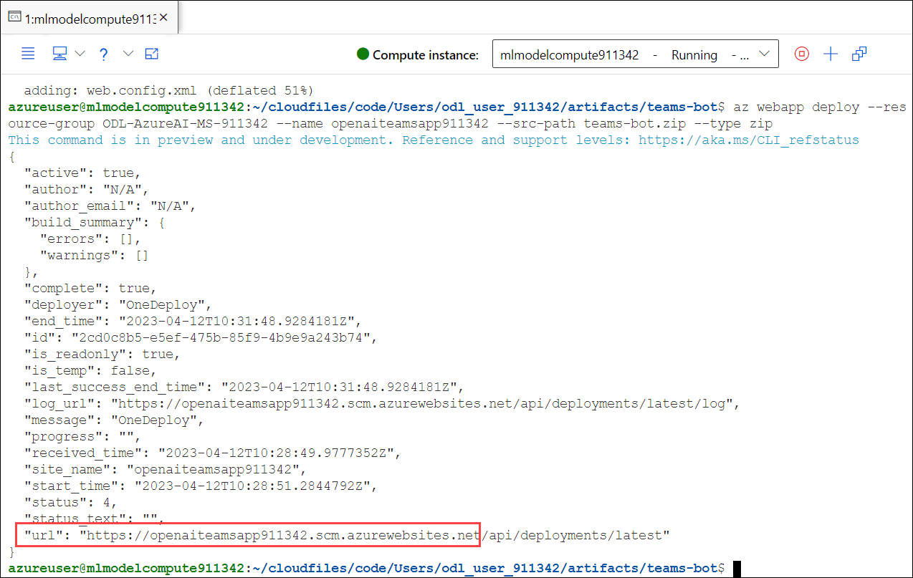

## Lab 3. Deploying the chatbot on Azure Bot Service and Azure App Service.


### Task 1 : Explore the chatbot codebase to understand user journey and dialogue development


### Task 2 : Update the configuration file with newly generated credentials


1. Navigate back to the Azure machine learning studio, and open a new terminal session.

   
   
1. Run the below commands in the terminal session:

   ```
   cd artifacts/teams-bot
   ```
   
   ```
   vim .env
   ```
   
   

1. Now you will navigating to the editor window, press **i** to get into the **insert mode**.

   
    
1. Replace the values in the **.env** file then click on **esc** followed by **:wq**.

    
    

### Task 3 : Deploy the chatbot on Azure Bot Service and Azure App Service

1. Within the terminal window run the below mentioned command to create zip folder.

   ```
   zip -r teams-bot.zip .
   ```
   > **Note :** Wait for 15-20 min till the command run successfully.

1. Now, run the below command after updating the `<DID>` with the value **<inject key="DeploymentID" enableCopy="false"/>**.

   ```
   az webapp deploy --resource-group ODL-AzureAI-MS-<DID> --name openaiteamsapp<DID> --src-path teams-bot.zip --type zip
   ```
   
1. After running the command successfully, copy the app URL in a notepad. You will be using it in coming tasks.

   
   

### Task 4: Publish the chatbot on Microsoft Teams channel using a manifest file
