## Exercise 3. Deploying the chatbot on Azure Bot Service and Azure App Service.

   In this exercise, you will be deploying the chatbot code to the app service and will connect it to the Azure Bot, later you will be integrating it will the MS team.
    
### Task 1: Explore the chatbot codebase to understand the user journey and dialogue development

1. You can explore the chatbot codebase under the teams-bot directory. There have multiple directory and .env files that we will be updating while performing the lab.
 
    

1. You can also expand the bot folder and you can go through the code for the dialog bot and understand how it is working.

    
    
1. You can also review the code under dialogs and understand the flow.

    

### Task 2: Update the configuration file with newly generated credentials


1. Navigate back to the Visual Studio code and follow the below instructions to update the values in the .env file.

    - Click on **Explorer (1)**
    - Expand **Code[Azure ML : MLModelCompute<inject key="DeploymentID" enableCopy="false"/>] (2)**
    - Expand **Users/odl_user_<inject key="DeploymentID" enableCopy="false"/>/artifacts/teams-bot (3)**
    - Select **.env (4)** file.

    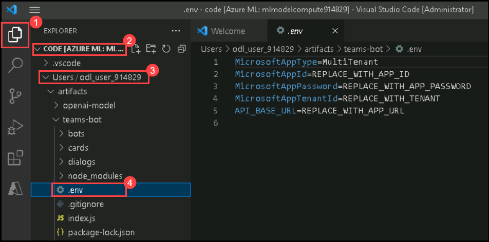
    
    
1. Replace the values in the **.env** file, you can obtaining the values from **Environment Details (1)** page, under **Service Principal Details (2)**. 

     - **MicrosoftAppId**= Enter **Application Id (3)** value from Service Principal Details
     - **MicrosoftAppPassword**= Enter **Secret Key (4)** value from Service Principal Details
     - **MicrosoftAppTenantId**= Enter **Tenant Id (Directory id) (5)** value from Service Principal Details
     - **API_BASE_URL**= Enter **https://openaiwebapp<inject key="DeploymentID" enableCopy="false"/>.azurewebsites.net**

          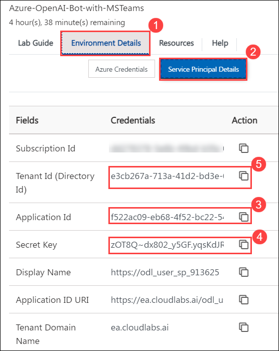

1. After updating the values, save the file by clicking **ctrl + S**

     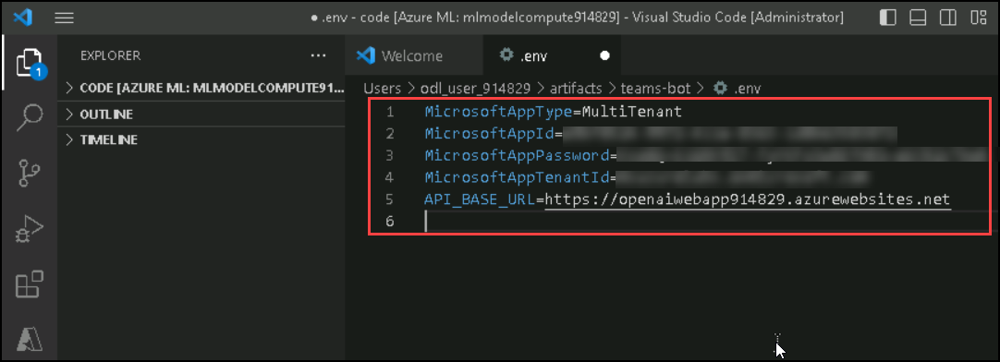    

### Task 3: Deploy the chatbot on Azure Bot Service and Azure App Service


1. Follow the below-mentioned instructions to deploy the web app:

    - Click on **Azure (1)**
    - Expand **Resources (2)**
    - Expand the assigned **Subscription (3)**
    - Right-click on **openaiteamsapp<inject key="DeploymentID" enableCopy="false"/> (4)**
    - Click on **Deploy to Web App (5)**.

    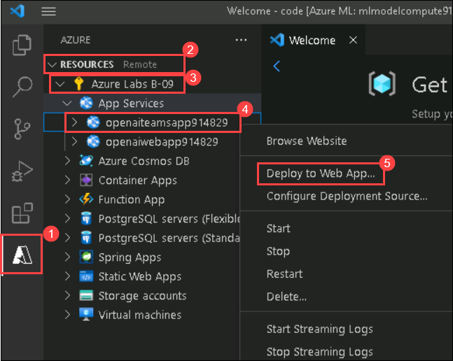
   
1. Navigate to the path **/home/azureuser/cloudfiles/code/Users/odl_user_/artifacts/teams-bot/ (1)** and click on **Ok (2)**.   

    
    
3. On Visual Studio Code pop up click on **Yes**

    
    
1. On the pop up **Are you sure you want to deploy to "openaiteamsapp<inject key="DeploymentID" enableCopy="false"/>"?** click on **Deploy**.

    
    
1. Make sure that the deployment is completed on the web app.

    
       
    > **Note:** Wait for 10-15 minutes until the deployment is completed.
    
### Task 4: Publish the chatbot on the Microsoft Teams channel using a manifest file

1. Navigate back to the Azure portal and from the Overview page of the resource group select Azure Bot **openai-bot-<inject key="DeploymentID" enableCopy="false"/>**.

    
    
1. On the Azure bot page, follow the below-given instructions:

    - Click on  **Configuration (1)**
    - Message endpoint : Enter **https://openaiteamsapp<inject key="DeploymentID" enableCopy="false"/>.azurewebsites.net/api/messages**
    - Click on **Apply (3)**

    

1. Click on **Channels (1)** and scroll down to Available channels and select **Microsoft Teams (2)**.

    
    
1. Check the box next to **I agree to the Microsoft Channel Publication Terms and the Microsoft Privacy Statements for my deployment to the Microsoft Teams channels** and click on  **Agree (2)**.

    
    
1. Leave everything as default on the Microsoft Teams page and click on **Apply**.

    
    
1. Once the changes are applied successfully, click on **Close**.

    
    
1. You can view Microsoft Teams under Channels. Now click on **Open in Teams** URL to open the application.

    
    
1. On **Microsoft Teams** window, select **Use web app instead**.

    
    
1. Send a message **Hi** in the chat **Openai-bot-<inject key="DeploymentID" enableCopy="false"/>**, you will see a response from the chatbot and explore through the available chatbot options.

    

1. Select the **ITSM** option to raise a ticket for any of your queries.

   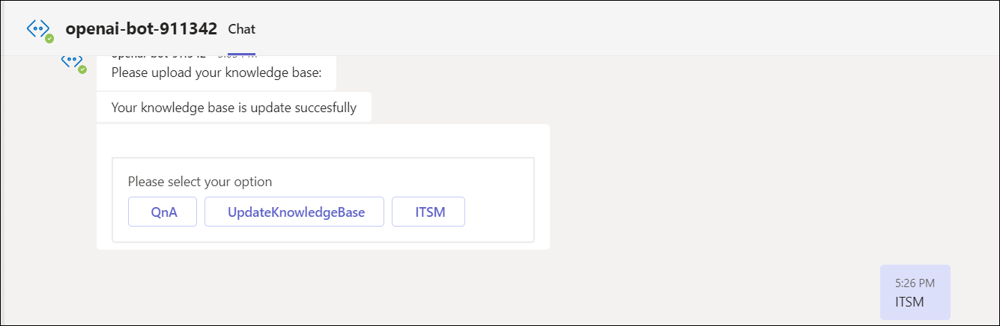
    
1. Now click on **Raise Ticket** and enter the query.

    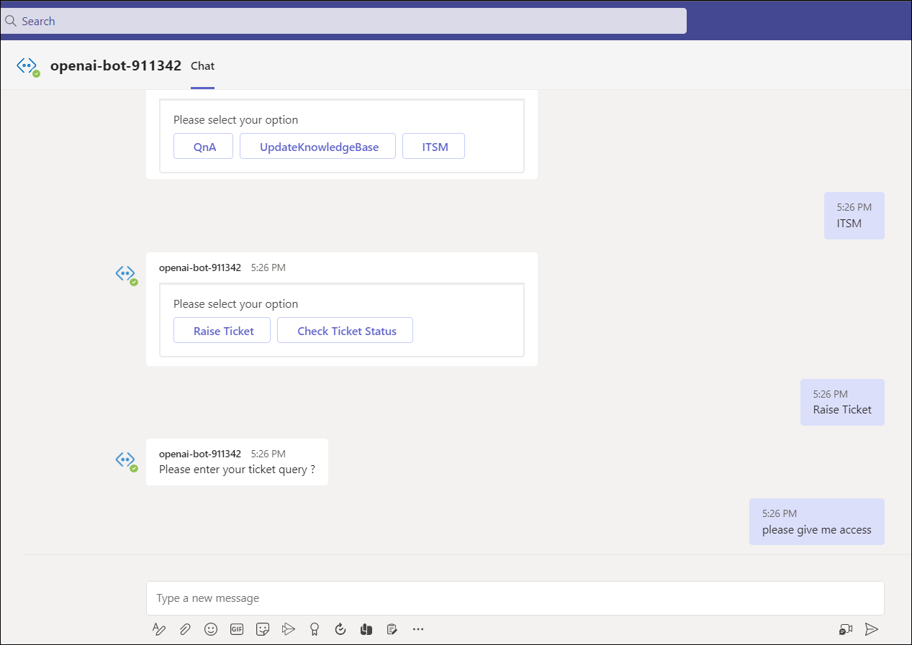
  
1. To check the status of the ticket click on **Check Ticket Status**.

    

1. Now choose **QnA** option on the teams chat.

    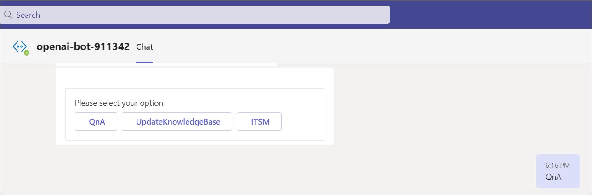
    
1. On **Select knowledge base from below** tab, choose the **jira-faq (1)** document and click on **Submit (2)**.

    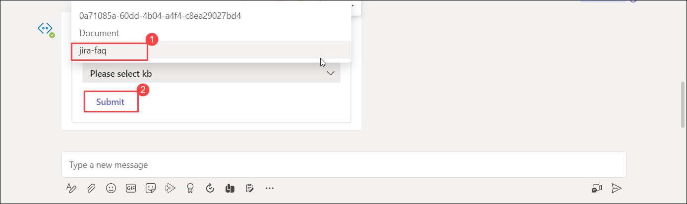
    
1. Enter the below query and review the reply provided by the bot.

    ```
    Who are agents in Jira Jira Service Management?
    ```
    
    
    
1. If you want to restart the bot, enter **Restart** and hit enter.

    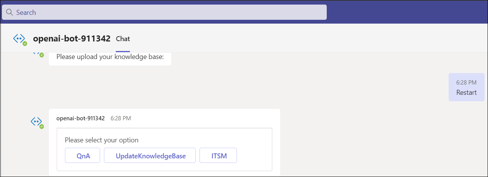


### Task 5: Add more knowledge base documents using Azure Logic Apps. 

1. Navigate back to the Azure Portal and from the **Overview (1)** page of the resource group select **azureblob (2)** API connection.

   

1. Navigate back to the resource group and from the **Overview (1)** page of the resource group select **azureblob (2)** API connection.

    
    
1. On the azureblob API connection page, follow the below-mentioned instruction : 

    - Click on **Edit API connection (1)**
    - **Azure Storage account name or blob endpoint** :  Enter **mlstorageaccount<inject key="DeploymentID" enableCopy="false"/> (2)**
    - **Azure Storage Account Access Key** : Enter **<inject key="StorageaccountKey" enableCopy="true"/> (3)**
    - Click on **Save (4)**

    

1. From Azure Portal, navigate to Logic app **openai-logicapp-<inject key="DeploymentID" enableCopy="false"/>** and click on **Enable**.

    
    
1. Now from the **Overview (1)** page of resource group select **mlstorageaccount<inject key="DeploymentID" enableCopy="false"/> (2)**.

    
    
1. Click on **Containers (1)** from Data Storage anc click on **samples-workitems (2)**.

    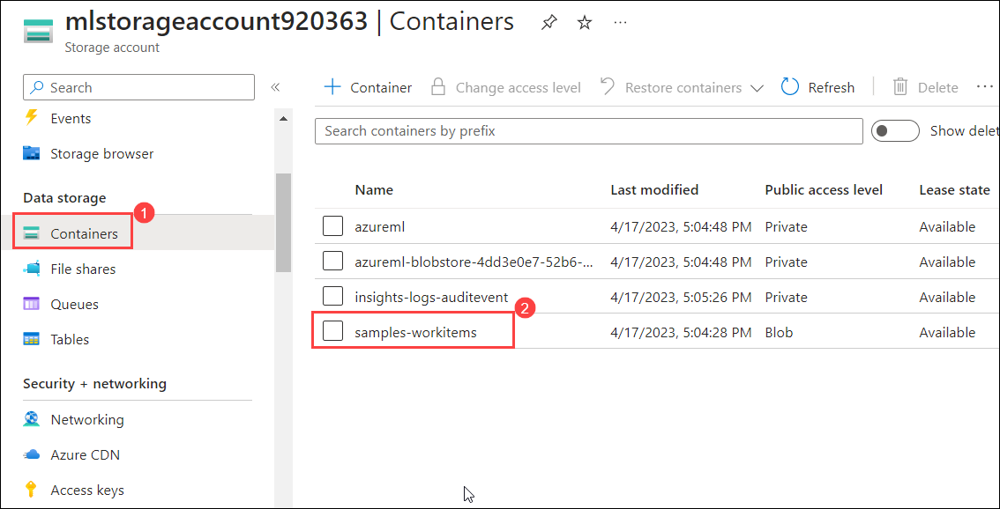
    
1. On **sample-workitems** page, click on **Upload (1)** and click on **Browse for files (2)**.

    
    
1. Navigate to the folder **Downloads (1)**, select **atlassian-faq (2)** pdf file and click on **Open (3)**.

    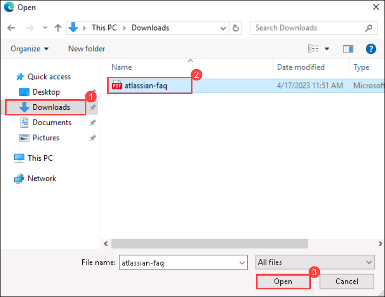
    
1. Click on **Upload**.

    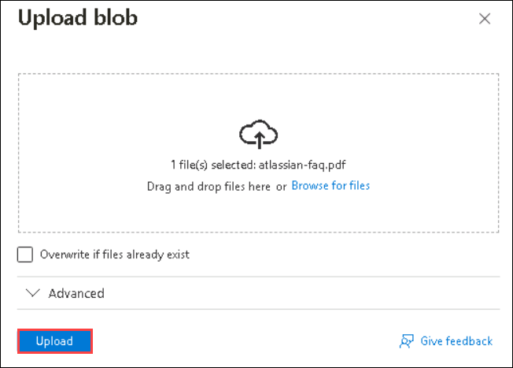
    
1. Navigate to Logic app **openai-logicapp-<inject key="DeploymentID" enableCopy="false"/>** and click on **Run trigger (1)** then click on **Run (2)**.

    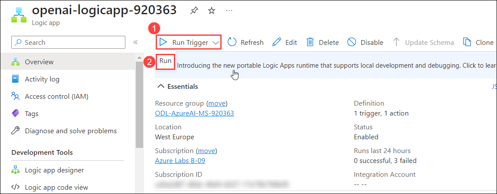
    
1. Click on **Runs histroy (1)** then review that the run status as in **Succeeded (2)**.

    
    
1. Now navigate back to the team's bot to verify the latest document added to the bot.

1. Enter Restart the bot to have the changes reflected. 

   > **Note:** Wait for 2-3 minutes to get the bot get restarted.

1. Once the bot is restarted, Send Hi to start the conversation and select qna to see the documentation. 

    

1.  Select the document from where you want to get the query and click on Submit.

      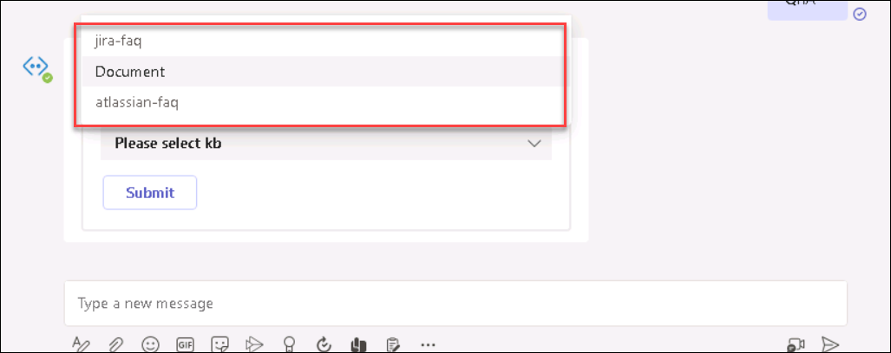
      
1. You can start checking for queries.

    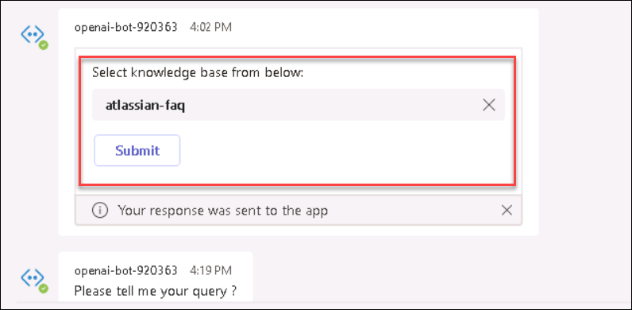
    
The lab ends here. You have learned how to work with Azure OpenAI and integrate it with your knowledge base. 
