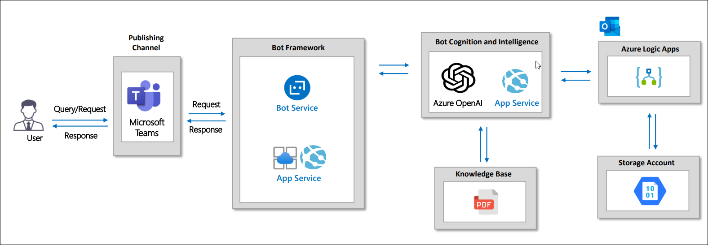
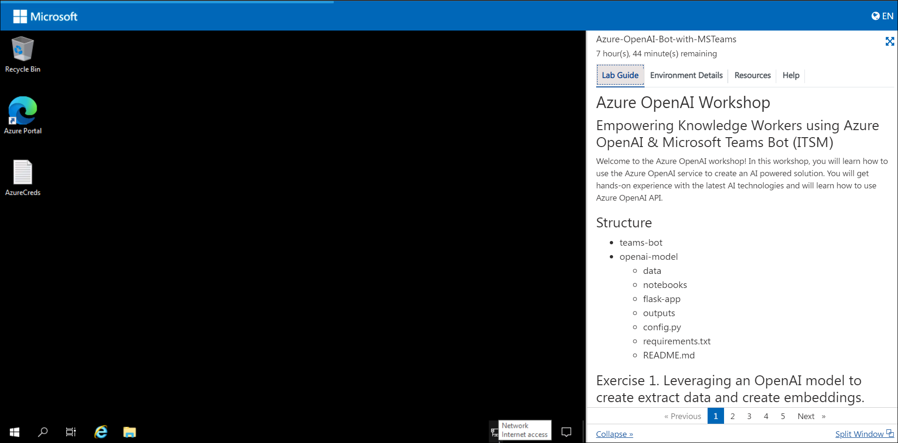
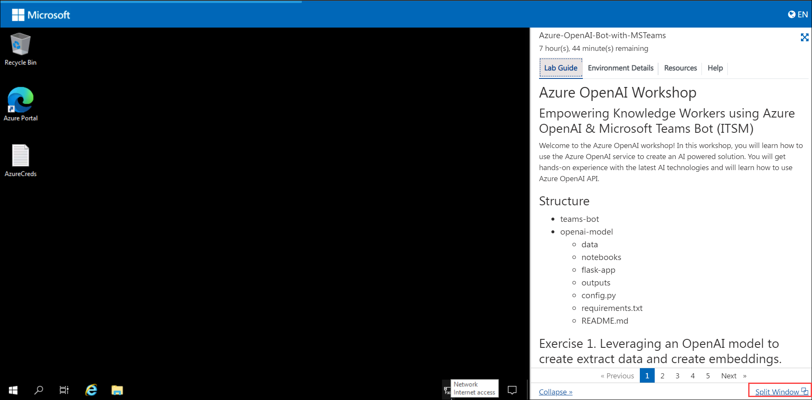
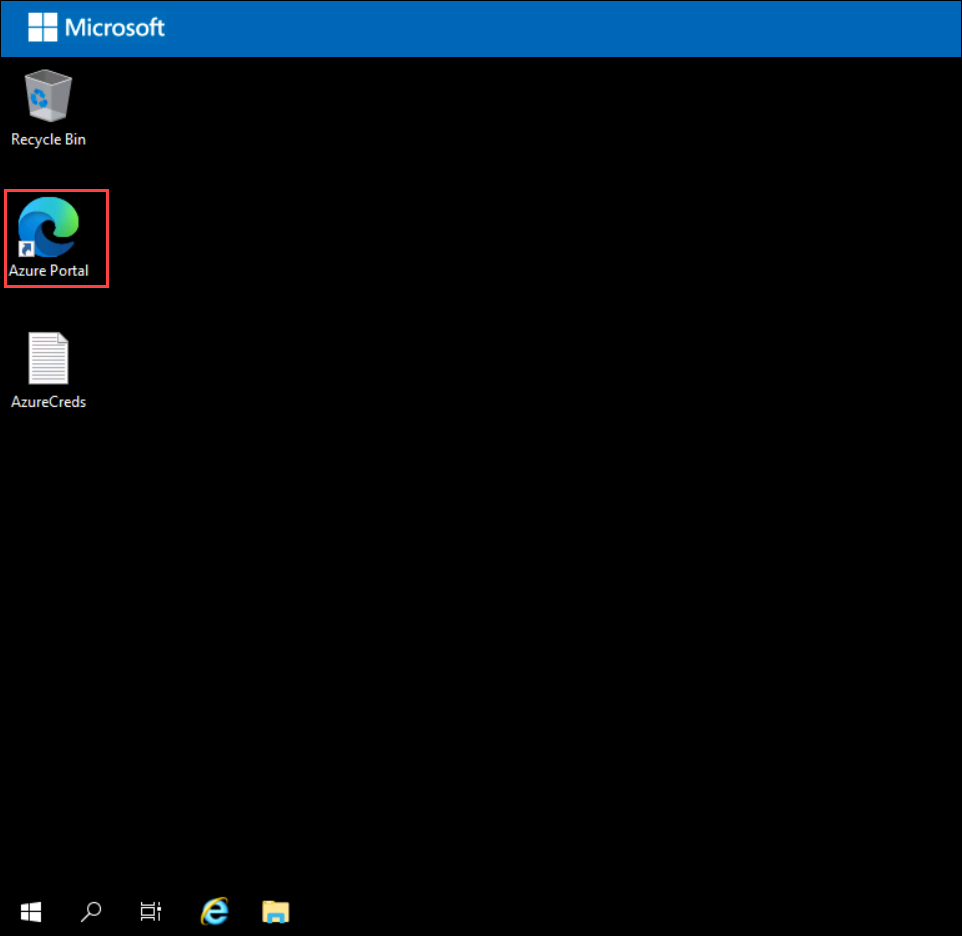

# Empower Knowledge Workers using Azure OpenAI with MS Teams and Azure Bot Service

### Overall Estimated Duration: 4 hours

## Overview

Contoso leverages **Azure OpenAI** to build a sophisticated AI assistant integrated with **Microsoft Teams** and **Azure Bot Service**. This setup allows employees to interact with the assistant for context-aware support, automating routine tasks, retrieving company knowledge, and receiving intelligent recommendations. The integration enhances productivity, streamlines workflows, and improves decision-making by embedding advanced AI capabilities directly within their communication platform.

In this hands-on lab, you will earn how to use the Azure OpenAI service to create an AI powered solution with the latest AI technologies.

## Objective

Learn to leverage an OpenAI model to extract data and create embeddings, deploy it with Flask locally and on Azure App Service, and integrate the chatbot with Azure Bot Service and Azure Logic Apps for end-to-end automation and communication.

1. **Leveraging an OpenAI model to create extract data and create embeddings:** Use an OpenAI model to extract data and create embeddings for advanced data processing and retrieval. Participants will learn to extract data and create embeddings using an OpenAI model for advanced data analysis.

1. **Deploying the model using Flask framework locally and on Azure App Service:** Deploy the model locally with Flask and on Azure App Service for scalable web access. Participants will achieve the deployment of the OpenAI model both locally with Flask and on Azure App Service for scalable web-based access.

1. **Deploying the chatbot on Azure Bot Service and Azure App Service and Setting up Email Automation Workflow on Azure Logic:** Deploy the chatbot on Azure Bot Service and Azure App Service, and set up an email automation workflow using Azure Logic Apps for seamless communication. Participants will successfully deploy a chatbot on Azure Bot Service and Azure App Service, and set up an email automation workflow using Azure Logic Apps for integrated communication and automation.

## Prerequisites

Participants should have:

- **Understanding of AI and Machine Learning:** Basic knowledge of data extraction and embeddings with OpenAI models.
- **Proficiency in Python and Flask:** Experience in building and deploying web applications using Flask.
- **Familiarity with Azure Services:** Knowledge of Azure App Service, Azure Bot Service, and Azure Logic Apps.
- **Web Development Skills:** Experience in developing and managing web-based applications.
- **Cloud Deployment Skills:** Basic understanding of deploying applications on cloud platforms like Azure.

## Architecture

The architecture involves using **Azure OpenAI Service** to provide advanced AI capabilities for data extraction and embedding creation. A **Flask** application serves as the interface to deploy this model locally and on **Azure App Service**, which hosts the web application and manages scalability. The **Azure Bot Service** is used to deploy and manage the chatbot, integrating it with various communication channels. Finally, **Azure Logic Apps** automates workflows such as email notifications, enabling seamless communication and process automation triggered by interactions with the chatbot or other events within the system.

## Architecture Diagram

## Explanation of Components

- **Azure OpenAI Service:** Provides access to OpenAI models for tasks such as data extraction and creating embeddings. This service enables you to leverage advanced AI capabilities for processing and analyzing data.
- **Flask Framework:** A lightweight Python web framework used to build and deploy the OpenAI model locally. It also facilitates the deployment of the model on Azure App Service by creating a web application that interfaces with the AI model.
- **Azure App Service:** A fully managed platform for building, deploying, and scaling web apps. You'll use Azure App Service to host the Flask application and deploy the OpenAI model in a scalable and secure environment.
- **Azure Bot Service:** Enables you to deploy, manage, and integrate the chatbot into various channels, including Microsoft Teams and web applications. This service provides tools for creating and maintaining conversational AI solutions.
- **Azure Logic Apps:** Facilitates the creation of automated workflows, including email automation. You’ll use Logic Apps to set up workflows that automate email notifications and other processes triggered by events or data changes.

## Getting Started with the Lab

1. Once the environment is provisioned, a virtual machine and lab guide will get loaded in your browser. Use this virtual machine throughout the workshop to perform the lab.

    

1. To get the lab environment details, you can select the **Environment Details** tab. Additionally, the credentials will also be emailed to your email address provided at registration.

    
    
1. You can also open the Lab Guide in a separate full window by selecting the **Split Window** icon at the bottom right corner.

     
    
    
## Login to Azure Portal and verify the pre-deployed resources

1. Open Azure Portal from the desktop by double-clicking on it.
    
   
   
2. On the **Sign into Microsoft Azure** tab, you will see the login screen, enter the following username, and, then click on **Next**.

   * Email/Username: <inject key="AzureAdUserEmail"></inject>

   

3. Now enter the following password and click on **Sign in**. 

   * Password: <inject key="AzureAdUserPassword"></inject>

   

4. If you see the pop-up **Stay Signed in?**, click on **No**.

   

5. If you see the pop-up **You have free Azure Advisor recommendations!**, close the window to continue the lab.

6. If a **Welcome to Microsoft Azure** popup window appears, click **Cancel** to skip the tour.

7. Now you can see Azure Portal Dashboard, click on **Resource groups** from the Navigate panel to see the resource groups.

   
 
8. We have already pre-deployed all the required resources, which you will be using throughout the lab.
 
## Support Contact
 
The CloudLabs support team is available 24/7, 365 days a year, via email and live chat to ensure seamless assistance at any time. We offer dedicated support channels tailored specifically for both learners and instructors, ensuring that all your needs are promptly and efficiently addressed.

Learner Support Contacts:
- Email Support: labs-support@spektrasystems.com
- Live Chat Support: https://cloudlabs.ai/labs-support

Now, click on **Next** from the lower right corner to move on to the next page.

### Happy Learning!!

