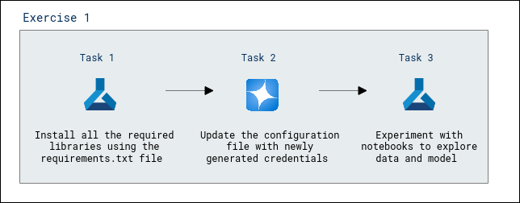
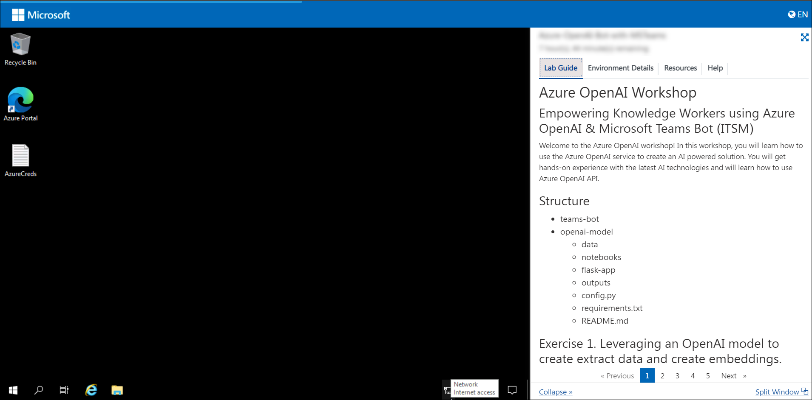
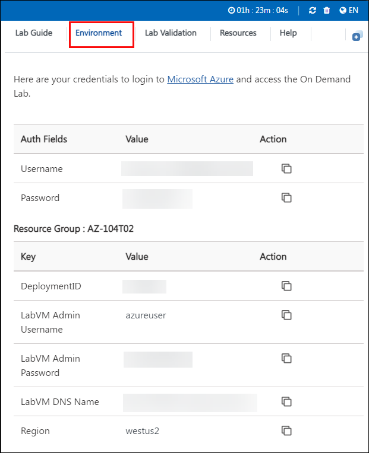
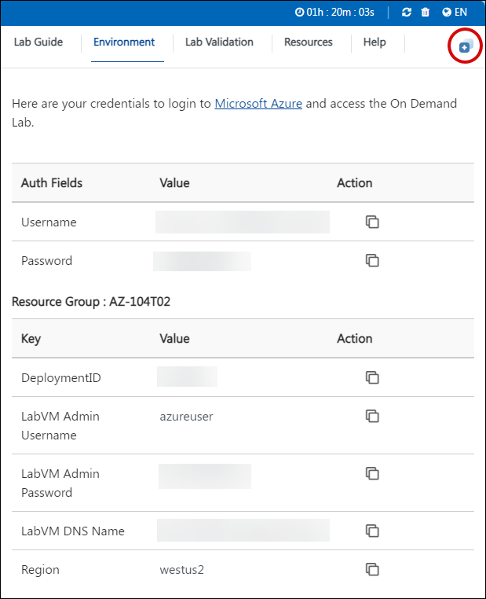

# Empower Knowledge Workers using Azure OpenAI with MS Teams and Azure Bot Service

### Overall Estimated Duration: 60 minutes

## Overview

In this lab, you will explore how to empower knowledge workers by integrating Azure OpenAI with a Microsoft Teams Bot for IT Service Management (ITSM). You will begin by leveraging an OpenAI model to extract data and create embeddings by installing necessary packages and running a Python notebook in Azure Machine Learning Studio. Through hands-on tasks, you will deploy the OpenAI model, configure credentials, and experiment with notebooks, gaining practical experience in data exploration and embedding creation.

## Objective

Learn to leverage an OpenAI model to extract data and create embeddings, by end of this lab you will be able to:

- **Leveraging an OpenAI model to create extract data and create embeddings:** Use an OpenAI model to extract data and create embeddings for advanced data processing and retrieval. Participants will learn to extract data and create embeddings using an OpenAI model for advanced data analysis.

## Prerequisites

Participants should have:

- **Knowledge of Azure Machine Learning Studio**: Familiarity with deploying and working in Azure ML Studio.
- **Basic Python Programming Skills**: Ability to run Python notebooks and update configuration files.
- **Experience with OpenAI Models**: Understanding of OpenAI's capabilities, such as generating embeddings and processing data.
  
## Architecture

The architecture integrates Azure OpenAI Service with Azure Machine Learning Studio to create embeddings for ITSM applications. Data is processed through Python notebooks in Azure ML Studio, which deploys the OpenAI model for embedding creation. The embeddings are then used to enhance ITSM workflows in applications like Microsoft Teams Bot, ensuring efficient knowledge retrieval and interaction.

## Architecture Diagram

## Explanation of Components

The architecture for this lab involves the following key components:

- **Azure OpenAI Service**: Provides powerful AI models for generating embeddings and analyzing data for ITSM use cases.
- **Azure Machine Learning Studio**: A platform for running Python notebooks, managing libraries, and deploying the OpenAI model.
- **Python Notebooks**: Used for experimenting with data and generating embeddings by running pre-configured scripts.
- **Requirements File**: Lists the necessary libraries and dependencies for seamless execution of Python notebooks.

## Getting Started with Lab

Once you're ready to dive in, your virtual machine and lab guide will be right at your fingertips within your web browser.

## Virtual Machine & Lab Guide

In the integrated environment, the lab VM serves as the designated workspace, while the lab guide is accessible on the right side of the screen.

**Note**: Kindly ensure that you are following the instructions carefully to ensure the lab runs smoothly and provides an optimal user experience.

## Exploring Your Lab Resources

To get a better understanding of your lab resources and credentials, navigate to the **Environment Details** tab.

## Utilizing the Split Window Feature

For convenience, you can open the lab guide in a separate window by selecting the Split Window button from the top right corner.

## Lab Guide Zoom In/Zoom Out
 
To adjust the zoom level for the environment page, click the **A↕ : 100%** icon located next to the timer in the lab environment.

  

## Managing Your Virtual Machine

Feel free to start, stop, or restart your virtual machine as needed from the **Resources** tab. Your experience is in your hands!

    
    
## Login to Azure Portal and verify the pre-deployed resources

1. Open Azure Portal from the desktop by double-clicking on it.
    
   
   
1. On the **Sign into Microsoft Azure** tab, you will see the login screen, enter the following username, and, then click on **Next**.

   * **Email/Username**: <inject key="AzureAdUserEmail"></inject>

     
   
1. Now enter the following password and click on **Sign in**.
   
   * **Password**: <inject key="AzureAdUserPassword"></inject>
   
     

1. If you see the pop-up Action Required, click **Ask Later**.

   

   >**NOTE:** Do not enable MFA, select **Ask Later**.

1. If you see the pop-up **Stay Signed in?**, click on **No**.

1. If you see the pop-up **You have free Azure Advisor recommendations!**, close the window to continue the lab.

1. If a **Welcome to Microsoft Azure** popup window appears, click **Cancel** to skip the tour.

1. Now you can see Azure Portal Dashboard, click on **Resource groups** from the Navigate panel to see the resource groups.

   
 
1. We have already pre-deployed all the required resources, which you will be using throughout the lab.
 
## Support Contact
 
The CloudLabs support team is available 24/7, 365 days a year, via email and live chat to ensure seamless assistance at any time. We offer dedicated support channels tailored specifically for both learners and instructors, ensuring that all your needs are promptly and efficiently addressed.

Learner Support Contacts:
- Email Support: cloudlabs-support@spektrasystems.com
- Live Chat Support: https://cloudlabs.ai/labs-support

Now, click on **Next** from the lower right corner to move on to the next page.

  

### Happy Learning!!
